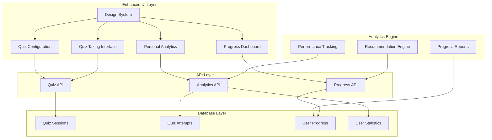
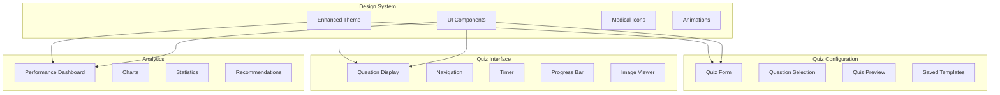

# Design Document

## Overview

The Improved User Interface and Quiz Creation system enhances the existing Pathology Qbank platform with a modern, intuitive design, streamlined quiz creation flow, and comprehensive personal analytics dashboard. The design builds upon the current Next.js, Supabase, and shadcn/ui foundation while improving user experience, visual design, and personal learning analytics.

The system focuses on enhancing the individual user experience with better visual design, simplified quiz configuration, improved quiz-taking interface, and detailed personal performance analytics that help users track their learning progress.

## Architecture

### High-Level Architecture



### Component Architecture



## Components and Interfaces

### 1. Enhanced Design System

**Location:** `src/shared/components/design-system/`

**Key Components:**
- **ThemeProvider**: Advanced theming with dark/light mode and accessibility
- **ComponentLibrary**: Standardized UI components with consistent styling
- **IconSystem**: Comprehensive medical and educational icon library
- **AnimationSystem**: Smooth transitions and micro-interactions

**Theme Configuration:**
```typescript
interface EnhancedTheme {
  colors: {
    primary: ColorScale;
    secondary: ColorScale;
    accent: ColorScale;
    semantic: {
      success: ColorScale;
      warning: ColorScale;
      error: ColorScale;
      info: ColorScale;
    };
    medical: {
      pathology: string;
      anatomy: string;
      clinical: string;
    };
  };
  typography: {
    medical: FontFamily;
    interface: FontFamily;
    monospace: FontFamily;
  };
  spacing: SpacingScale;
  animations: AnimationConfig;
  accessibility: AccessibilityConfig;
}
```

### 2. Improved Quiz Configuration

**Location:** `src/features/quiz/components/QuizConfiguration/`

**Key Features:**
- Streamlined quiz setup form with better UX
- Enhanced question filtering and selection
- Visual quiz preview before starting
- Saved quiz templates for quick setup
- Smart defaults based on user history

**Props Interface:**
```typescript
interface QuizConfigurationProps {
  initialConfig?: QuizConfig;
  onStart: (config: QuizConfig) => Promise<void>;
  onSaveTemplate: (template: QuizTemplate) => Promise<void>;
  userTemplates: QuizTemplate[];
  questionStats: QuestionTypeStats;
}

interface QuizConfigurationState {
  config: QuizConfig;
  availableQuestions: number;
  estimatedTime: number;
  previewQuestions: QuestionWithDetails[];
  validationErrors: ValidationError[];
}
```

### 3. Enhanced Quiz Taking Interface

**Location:** `src/features/quiz/components/QuizInterface/`

**Key Features:**
- Responsive design optimized for all devices
- Image zoom and pan capabilities
- Accessibility-first navigation
- Smart timer with visual indicators
- Progress tracking with milestones

**Props Interface:**
```typescript
interface QuizInterfaceProps {
  session: QuizSession;
  currentQuestion: QuestionWithDetails;
  onAnswer: (answerId: string) => Promise<void>;
  onNext: () => void;
  onPrevious: () => void;
  onPause: () => Promise<void>;
  onComplete: () => Promise<void>;
  settings: QuizDisplaySettings;
}

interface QuizDisplaySettings {
  showProgress: boolean;
  showTimer: boolean;
  enableImageZoom: boolean;
  fontSize: 'small' | 'medium' | 'large';
  highContrast: boolean;
  reducedMotion: boolean;
}
```

### 4. Personal Analytics Dashboard

**Location:** `src/features/analytics/components/PersonalAnalytics/`

**Key Features:**
- Personal performance tracking and trends
- Category-wise progress visualization
- Study streak and achievement tracking
- Personalized recommendations
- Progress export for personal records

**Props Interface:**
```typescript
interface PersonalAnalyticsProps {
  userId: string;
  timeRange: DateRange;
  onExport: (format: 'pdf' | 'csv') => Promise<void>;
}

interface PersonalAnalyticsData {
  overallStats: {
    totalQuizzes: number;
    averageScore: number;
    studyStreak: number;
    totalTimeStudied: number;
  };
  categoryProgress: CategoryProgress[];
  recentPerformance: PerformanceData[];
  recommendations: string[];
  achievements: Achievement[];
}
```

## Data Models

### Enhanced Quiz Configuration

```typescript
interface EnhancedQuizConfig extends QuizConfig {
  // User preferences
  savedAsTemplate: boolean;
  templateName?: string;
  
  // Display preferences
  displaySettings: QuizDisplaySettings;
  
  // Analytics tracking
  trackingEnabled: boolean;
  analyticsLevel: 'basic' | 'detailed';
}

interface QuizTemplate {
  id: string;
  name: string;
  description?: string;
  config: QuizConfig;
  createdAt: string;
  lastUsed: string;
  useCount: number;
}
```

### Analytics Data Models

```typescript
interface PerformanceMetrics {
  overall: {
    totalQuizzes: number;
    averageScore: number;
    completionRate: number;
    averageTime: number;
  };
  byDifficulty: Record<string, MetricData>;
  byCategory: Record<string, MetricData>;
  byTimeframe: TimeframedData[];
  trends: TrendAnalysis;
}

interface QuestionAnalyticsData {
  questionId: string;
  title: string;
  category: string;
  difficulty: string;
  statistics: {
    totalAttempts: number;
    correctAttempts: number;
    averageTime: number;
    difficultyIndex: number;
    discriminationIndex: number;
    responseDistribution: ResponseDistribution;
  };
  performance: {
    successRate: number;
    averageScore: number;
    timeEfficiency: number;
  };
  recommendations: string[];
}

interface UserProgressData {
  userId: string;
  overallProgress: {
    questionsAttempted: number;
    questionsCorrect: number;
    averageScore: number;
    studyStreak: number;
  };
  categoryProgress: CategoryProgressData[];
  learningPath: LearningPathData;
  achievements: Achievement[];
  recommendations: PersonalizedRecommendation[];
}
```

### Adaptive Learning Models

```typescript
interface AdaptiveLearningEngine {
  userModel: UserKnowledgeModel;
  questionModel: QuestionDifficultyModel;
  adaptationRules: AdaptationRule[];
  recommendationEngine: RecommendationEngine;
}

interface UserKnowledgeModel {
  userId: string;
  knowledgeState: Record<string, KnowledgeLevel>; // topic -> knowledge level
  learningStyle: LearningStyleProfile;
  performanceHistory: PerformanceHistoryData[];
  confidenceScores: Record<string, number>;
}

interface QuestionDifficultyModel {
  questionId: string;
  baseDifficulty: number;
  adaptiveDifficulty: number;
  prerequisites: string[];
  learningObjectives: string[];
  cognitiveLoad: number;
}
```

## Error Handling

### Quiz Session Management

```typescript
interface QuizSessionError {
  type: 'network' | 'timeout' | 'data_corruption' | 'permission_denied';
  message: string;
  recoverable: boolean;
  recoveryActions: RecoveryAction[];
  context: ErrorContext;
}

interface RecoveryAction {
  id: string;
  label: string;
  description: string;
  action: () => Promise<void>;
  risk: 'low' | 'medium' | 'high';
}
```

### Analytics Error Handling

```typescript
interface AnalyticsError {
  type: 'calculation_error' | 'data_missing' | 'export_failed' | 'permission_denied';
  affectedMetrics: string[];
  fallbackData?: Partial<AnalyticsData>;
  retryable: boolean;
}
```

## Testing Strategy

### Component Testing

**Test Coverage Areas:**
- Design system component consistency and theming
- Quiz configuration form validation and UX
- Quiz interface responsiveness and accessibility
- Personal analytics dashboard data visualization
- Template system functionality

**Key Test Files:**
```
src/features/quiz/__tests__/
├── components/
│   ├── QuizConfiguration.test.tsx
│   ├── QuizInterface.test.tsx
│   └── PersonalAnalytics.test.tsx
├── hooks/
│   ├── useQuizConfiguration.test.ts
│   ├── useQuizSession.test.ts
│   └── usePersonalAnalytics.test.ts
└── services/
    ├── quiz-service.test.ts
    ├── analytics-service.test.ts
    └── recommendation-service.test.ts
```

### Integration Testing

**Test Scenarios:**
- End-to-end quiz creation and taking flow
- Analytics data pipeline from quiz completion to personal dashboard
- Template saving and reuse functionality
- Progress tracking and recommendation generation
- Export functionality for personal reports

### Performance Testing

**Key Metrics:**
- Quiz interface loading and rendering performance
- Personal analytics dashboard query performance
- Image loading and zoom functionality performance
- Mobile device performance optimization

### Accessibility Testing

**Accessibility Requirements:**
- WCAG 2.1 AA compliance
- Screen reader compatibility
- Keyboard navigation support
- High contrast mode support
- Reduced motion preferences

## Implementation Phases

### Phase 1: Enhanced Design System
- Implement comprehensive theme system with medical-focused styling
- Create standardized component library with consistent design patterns
- Add smooth animation and transition system
- Implement accessibility features and WCAG compliance

### Phase 2: Improved Quiz Configuration
- Redesign quiz setup form with better UX and visual hierarchy
- Implement enhanced question filtering and smart defaults
- Add quiz template system for saving and reusing configurations
- Create visual quiz preview functionality

### Phase 3: Enhanced Quiz Taking Interface
- Redesign quiz interface with modern, clean design
- Add responsive design optimizations for all devices
- Implement advanced image viewer with zoom and pan capabilities
- Create improved timer and progress tracking components

### Phase 4: Personal Analytics Dashboard
- Build comprehensive personal analytics engine
- Create interactive visualization components for progress tracking
- Implement personalized recommendation system
- Add export functionality for personal progress reports

### Phase 5: Advanced Features
- Implement user knowledge modeling and progress tracking
- Create adaptive recommendation engine based on performance
- Add achievement system and study streak tracking
- Build personalized learning path suggestions

### Phase 6: Performance & Polish
- Optimize performance for mobile devices and slow connections
- Add comprehensive error handling and recovery
- Implement advanced accessibility features
- Create comprehensive testing suite and documentation