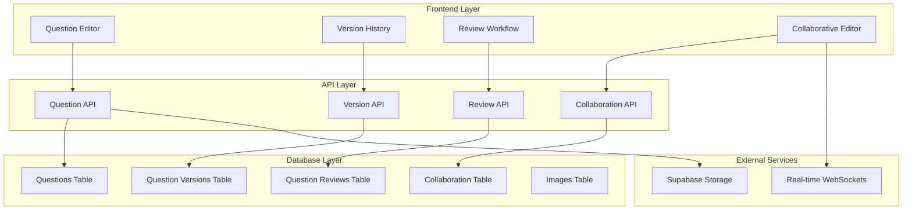

# Design Document

## Overview

The Enhanced Question Authoring/Editing Workflow with Versioning system builds upon the existing Pathology Qbank platform to provide comprehensive content creation, collaboration, and version management capabilities. The system leverages Supabase for data persistence, Next.js for the frontend, and integrates seamlessly with the existing question management infrastructure.

The design introduces a sophisticated versioning system using semantic versioning (major.minor.patch), collaborative editing features, and a streamlined review workflow while maintaining backward compatibility with the existing question structure.

## Architecture

### High-Level Architecture



### Database Schema Extensions

The design extends the existing database schema with new tables for versioning and collaboration:

```sql
-- Question Versions Table (extends existing structure)
CREATE TABLE question_versions (
    id UUID PRIMARY KEY DEFAULT gen_random_uuid(),
    question_id UUID REFERENCES questions(id) ON DELETE CASCADE,
    version_major INTEGER NOT NULL DEFAULT 1,
    version_minor INTEGER NOT NULL DEFAULT 0,
    version_patch INTEGER NOT NULL DEFAULT 0,
    version_string TEXT GENERATED ALWAYS AS (version_major || '.' || version_minor || '.' || version_patch) STORED,
    question_data JSONB NOT NULL, -- Complete question snapshot
    update_type TEXT CHECK (update_type IN ('patch', 'minor', 'major')),
    change_summary TEXT,
    changed_by UUID REFERENCES auth.users(id),
    created_at TIMESTAMPTZ DEFAULT NOW()
);

-- Question Reviews Table (extends existing structure)
CREATE TABLE question_reviews (
    id UUID PRIMARY KEY DEFAULT gen_random_uuid(),
    question_id UUID REFERENCES questions(id) ON DELETE CASCADE,
    version_id UUID REFERENCES question_versions(id),
    reviewer_id UUID REFERENCES auth.users(id),
    action TEXT CHECK (action IN ('approve', 'request_changes', 'reject')),
    feedback TEXT,
    changes_made JSONB,
    created_at TIMESTAMPTZ DEFAULT NOW()
);

-- Collaboration Sessions Table
CREATE TABLE question_collaboration_sessions (
    id UUID PRIMARY KEY DEFAULT gen_random_uuid(),
    question_id UUID REFERENCES questions(id) ON DELETE CASCADE,
    owner_id UUID REFERENCES auth.users(id),
    collaborators UUID[] DEFAULT '{}',
    session_data JSONB DEFAULT '{}',
    is_active BOOLEAN DEFAULT true,
    expires_at TIMESTAMPTZ,
    created_at TIMESTAMPTZ DEFAULT NOW(),
    updated_at TIMESTAMPTZ DEFAULT NOW()
);

-- Question Comments Table
CREATE TABLE question_comments (
    id UUID PRIMARY KEY DEFAULT gen_random_uuid(),
    question_id UUID REFERENCES questions(id) ON DELETE CASCADE,
    user_id UUID REFERENCES auth.users(id),
    content TEXT NOT NULL,
    comment_type TEXT CHECK (comment_type IN ('general', 'suggestion', 'review')),
    parent_id UUID REFERENCES question_comments(id),
    resolved BOOLEAN DEFAULT false,
    created_at TIMESTAMPTZ DEFAULT NOW()
);
```

## Components and Interfaces

### 1. Enhanced Question Editor Component

**Location:** `src/features/questions/components/QuestionEditor.tsx`

**Key Features:**
- Rich text editor with medical terminology support
- Real-time collaborative editing
- Auto-save with version tracking
- Image upload and management
- Template system

**Props Interface:**
```typescript
interface QuestionEditorProps {
  questionId?: string;
  mode: 'create' | 'edit' | 'collaborate';
  onSave: (data: QuestionFormData) => Promise<void>;
  onVersionCreate: (type: UpdateType) => Promise<void>;
  collaborationEnabled?: boolean;
  templateId?: string;
}
```

### 2. Version History Component

**Location:** `src/features/questions/components/VersionHistory.tsx`

**Key Features:**
- Timeline view of all versions
- Side-by-side comparison
- Restore to previous version
- Change highlighting

**Props Interface:**
```typescript
interface VersionHistoryProps {
  questionId: string;
  currentVersion: QuestionVersionInfo;
  onRestore: (versionId: string) => Promise<void>;
  onCompare: (v1: string, v2: string) => void;
}
```

### 3. Review Workflow Component

**Location:** `src/features/questions/components/ReviewWorkflow.tsx`

**Key Features:**
- Review queue management
- Approval/rejection interface
- Feedback system
- Batch operations

**Props Interface:**
```typescript
interface ReviewWorkflowProps {
  questions: QuestionWithReviewDetails[];
  onReview: (questionId: string, review: ReviewFormData) => Promise<void>;
  onBatchAction: (questionIds: string[], action: ReviewAction) => Promise<void>;
  userRole: 'author' | 'reviewer' | 'admin';
}
```

### 4. Collaboration Hub Component

**Location:** `src/features/questions/components/CollaborationHub.tsx`

**Key Features:**
- Real-time presence indicators
- Comment system
- Suggestion tracking
- Conflict resolution

**Props Interface:**
```typescript
interface CollaborationHubProps {
  questionId: string;
  sessionId: string;
  currentUser: User;
  onInviteCollaborator: (email: string) => Promise<void>;
  onResolveConflict: (conflictId: string, resolution: any) => Promise<void>;
}
```

## Data Models

### Enhanced Question Model

```typescript
interface EnhancedQuestionData extends QuestionData {
  // Version information
  version_major: number;
  version_minor: number;
  version_patch: number;
  version_string: string;
  
  // Workflow status
  workflow_status: 'draft' | 'pending_review' | 'approved' | 'rejected';
  
  // Collaboration
  collaboration_session_id?: string;
  last_edited_by: string;
  last_edited_at: string;
  
  // Review tracking
  review_count: number;
  last_reviewed_at?: string;
  last_reviewer_id?: string;
}
```

### Version Snapshot Model

```typescript
interface QuestionVersionSnapshot {
  id: string;
  question_id: string;
  version_info: QuestionVersionInfo;
  snapshot_data: {
    title: string;
    stem: string;
    difficulty: string;
    teaching_point: string;
    question_options: QuestionOptionFormData[];
    question_images: QuestionImageFormData[];
    metadata: Record<string, any>;
  };
  change_summary: string;
  changed_by: string;
  created_at: string;
}
```

### Collaboration Session Model

```typescript
interface CollaborationSession {
  id: string;
  question_id: string;
  owner_id: string;
  collaborators: CollaboratorInfo[];
  active_editors: string[];
  pending_suggestions: Suggestion[];
  session_status: 'active' | 'paused' | 'ended';
  created_at: string;
  expires_at: string;
}

interface CollaboratorInfo {
  user_id: string;
  email: string;
  name: string;
  role: 'editor' | 'reviewer' | 'viewer';
  joined_at: string;
  last_active: string;
}

interface Suggestion {
  id: string;
  author_id: string;
  field: string;
  original_value: any;
  suggested_value: any;
  reason: string;
  status: 'pending' | 'accepted' | 'rejected';
  created_at: string;
}
```

## Error Handling

### Version Conflict Resolution

```typescript
interface VersionConflict {
  type: 'concurrent_edit' | 'version_mismatch' | 'permission_denied';
  conflicting_fields: string[];
  local_changes: Record<string, any>;
  remote_changes: Record<string, any>;
  resolution_options: ConflictResolutionOption[];
}

interface ConflictResolutionOption {
  id: string;
  label: string;
  description: string;
  action: 'keep_local' | 'keep_remote' | 'merge' | 'manual_resolve';
}
```

### Error Recovery Strategies

1. **Auto-save Recovery**: Implement periodic auto-save with local storage backup
2. **Optimistic Updates**: Use optimistic UI updates with rollback capability
3. **Conflict Detection**: Real-time conflict detection during collaborative editing
4. **Graceful Degradation**: Fallback to read-only mode if collaboration fails

## Testing Strategy

### Unit Testing

**Test Coverage Areas:**
- Version creation and management logic
- Collaboration session handling
- Review workflow state transitions
- Data validation and sanitization

**Key Test Files:**
```
src/features/questions/__tests__/
├── services/
│   ├── version-service.test.ts
│   ├── collaboration-service.test.ts
│   └── review-service.test.ts
├── hooks/
│   ├── use-question-versioning.test.ts
│   └── use-collaboration.test.ts
└── utils/
    ├── version-utils.test.ts
    └── conflict-resolution.test.ts
```

### Integration Testing

**Test Scenarios:**
- End-to-end question creation with versioning
- Collaborative editing with multiple users
- Review workflow from submission to approval
- Version restoration and comparison

### Performance Testing

**Key Metrics:**
- Real-time collaboration latency
- Version history loading performance
- Large question set handling
- Concurrent user capacity

### Security Testing

**Security Considerations:**
- Row-level security for question access
- Version history access control
- Collaboration session permissions
- Input sanitization and validation

## Implementation Phases

### Phase 1: Core Versioning System
- Implement version tracking infrastructure
- Create version history UI components
- Add semantic versioning logic
- Implement version comparison tools

### Phase 2: Enhanced Editor
- Upgrade question editor with rich text capabilities
- Add auto-save functionality
- Implement template system
- Create bulk editing tools

### Phase 3: Collaboration Features
- Implement real-time collaborative editing
- Add comment and suggestion system
- Create collaboration session management
- Implement conflict resolution

### Phase 4: Review Workflow
- Create review queue interface
- Implement approval/rejection workflow
- Add batch review operations
- Create reviewer dashboard

### Phase 5: Analytics and Optimization
- Add performance monitoring
- Implement usage analytics
- Create optimization tools
- Add advanced search and filtering