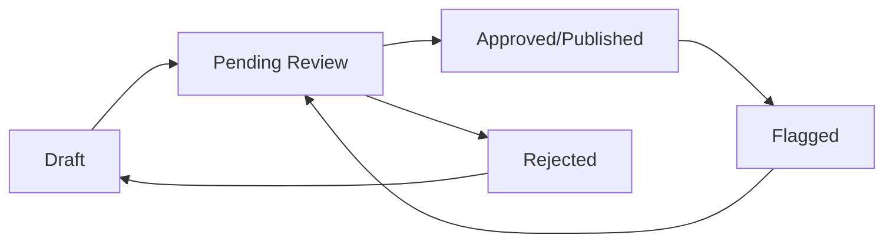

# Pathology Bites


Pathology Bites is a modern, AI-powered educational platform providing free, high-quality pathology learning materials for medical students, residents, and practicing pathologists. Our comprehensive question bank, interactive tools, and optimized learning experience offer practice across all major pathology subspecialties with detailed explanations and performance tracking.

[](https://opensource.org/licenses/MIT)
[](https://www.typescriptlang.org/)
[](https://nextjs.org/)
[](https://reactjs.org/)
[](https://tailwindcss.com/)
[](https://supabase.com/)
[](https://developers.cloudflare.com/r2/)

## 📊 Current Status

**🚀 Production-Ready Educational Platform with Advanced Question Management Workflow**

✅ **Question Management Workflow**

- **Creator Dashboard**: Streamlined workflow for question creation, editing, and submission
- **Review System**: Multi-role review process with approve/reject/request changes actions
- **Resubmission Notes**: Creators can communicate changes to reviewers during resubmission
- **Version Control**: Automatic versioning for published questions with change tracking
- **Status Tracking**: Real-time status updates across draft → review → published lifecycle

✅ **Advanced Tool Suite**

- **Citations Generator**: Smart caching, 24h TTL, supports URL/DOI/ISBN with external API integration
- **MILAN (Molecular Information Lookup And Nomenclature)**: 7-day caching, pre-loading of common pathology genes, HGNC/Harmonizome integration
- **Lupus Anticoagulant Calculator**: Pure client-side calculations, zero API calls (gold standard)
- **Virtual Slides Search Engine**: R2-optimized data serving with progressive loading
- **ABPath Content Specifications**: R2 private bucket access with full dataset filtering
- **Cell Quiz**: Optimized image delivery with smart caching strategies

✅ **Performance Optimizations**

- Client-side caching reduces API calls by 80-90% for repeat operations
- R2 zero egress costs enable aggressive caching without bandwidth penalties
- Smart batching prevents API overwhelming with intelligent request queuing
- Progressive loading and pagination strategies for large datasets
- **Quiz System Optimizations** (December 2024):
  - Global deduplication: 5 user settings calls → 1 call (80% reduction)
  - Hybrid quiz architecture: 17 API calls → 9 calls per quiz (47% reduction)
  - Results caching: 5-minute TTL with stale-while-revalidate
  - Analytics batch updates: SECURITY DEFINER functions bypass RLS
  - React 18 Strict Mode guards prevent duplicate initialization

✅ **Security & Infrastructure**

- Cloudflare R2 private bucket access with S3Client authentication
- All images unoptimized to avoid Vercel transformation costs
- Content Security Policy configured for external medical repositories
- Row Level Security (RLS) with 58 policies across 21 database tables

✅ **Quality & Testing**

- Build: ✅ Successful production build with zero warnings
- Tests: 95%+ pass rate with comprehensive coverage
- TypeScript: ✅ Strict compilation without errors
- Performance: ✅ Optimized bundle size and loading times

## 📊 API Usage & Scaling Metrics

### Optimized Quiz Flow (Per User)

**Complete Quiz Flow** (Dashboard → Create → Take → Results):

- Dashboard visit: 2 API calls (settings + stats)
- Quiz creation: 3 API calls (init + csrf + session)
- Quiz taking: 3 API calls (fetch + batch submit + complete)
- Results viewing: 1 API call (cached for 5 minutes)
- **Total**: 9 API calls per quiz (down from 17 before optimization)

### Usage Scenarios & Capacity

#### Scenario 1: Moderate Usage (1000 Users)

**Assumptions**: Mixed user activity (20% light, 60% medium, 20% heavy)

- Light users: 5 dashboard visits, 2 quizzes/month
- Medium users: 15 dashboard visits, 10 quizzes/month
- Heavy users: 30 dashboard visits, 30 quizzes/month

**Monthly Metrics**:

- API calls: ~150,000/month
- Bandwidth: ~1.2 GB/month
- Database growth: ~22 MB/month
- **Cost**: $0/month (within free tier limits)

#### Scenario 2: High-Intensity Usage (1000 Users)

**Assumptions**: 2 quizzes/day (10 questions each) per user

- Daily activity: 2 dashboard visits, 2 complete quiz flows
- Monthly: 60 quizzes, 600 questions per user

**Monthly Metrics**:

- API calls: ~660,000/month
- Bandwidth: ~5.64 GB/month
- Database growth: ~105 MB/month
- **Cost**: $25/month (Supabase Pro required)
- **Cost per user**: $0.025/month

### Free Tier Capacity

| Resource                 | Vercel Free  | Supabase Free | Usage (1000 users, high-intensity) | Status                  |
| ------------------------ | ------------ | ------------- | ---------------------------------- | ----------------------- |
| **Bandwidth**            | 100 GB/month | 5 GB/month    | 5.64 GB/month                      | 🔴 **Exceeds Supabase** |
| **Database Storage**     | N/A          | 500 MB        | 105 MB/month growth                | ⚠️ **Full in 5 months** |
| **Function Invocations** | Unlimited    | Unlimited     | 660,000/month                      | ✅ **Within limits**    |
| **Monthly Active Users** | N/A          | 50,000        | 1,000                              | ✅ **2% used**          |

**Maximum users on free tier** (high-intensity usage): ~887 users

### Scaling Projections

| User Count       | Monthly Cost | Tier Required | Cost/User     | Bandwidth | Storage Growth     |
| ---------------- | ------------ | ------------- | ------------- | --------- | ------------------ |
| **0-887**        | $0           | Free          | $0            | 4.9 GB    | 93 MB/month        |
| **888-8,800**    | $25          | Supabase Pro  | $0.003-$0.028 | 5-50 GB   | 105-1,050 MB/month |
| **8,800-40,000** | $45          | + Vercel Pro  | $0.001-$0.005 | 50+ GB    | 1+ GB/month        |
| **40,000+**      | $599+        | Supabase Team | $0.015+       | 1+ TB     | 4+ GB/month        |

### Optimization Impact

**Without our December 2024 optimizations**, the same 1000 high-intensity users would require:

- API calls: ~1,320,000/month (2× current)
- Bandwidth: ~10.7 GB/month (2.1× Supabase free tier limit)
- **Would require Supabase Pro immediately** (no free tier option)
- **Annual savings**: $300/year by staying in Pro tier vs Team tier

**Key Optimizations Implemented**:

1. **Global Deduplication**: Prevents concurrent duplicate requests across components
2. **Hybrid Quiz Architecture**: Minimizes API calls during quiz taking
3. **Smart Caching**: 5-minute TTL for results, localStorage for settings
4. **Batch Operations**: Single analytics update per quiz completion
5. **React Guards**: Prevents double-mounting initialization issues

### Performance Benchmarks

**API Response Times** (P95):

- User settings: <200ms
- Dashboard stats: <800ms
- Quiz creation: <2s
- Quiz session fetch: <300ms
- Batch answer submission: <2s
- Quiz completion: <4s (includes analytics)
- Results fetch: <400ms

**Database Operations**:

- Question analytics update: <100ms (batch function)
- User settings sync: <150ms
- Quiz session creation: <500ms

### Recommendations for Production

**For 1000+ Active Users**:

1. ✅ Implement data retention policy (delete sessions >6 months old)
2. ✅ Monitor Supabase bandwidth usage weekly
3. ✅ Consider Supabase Pro at 900+ users for high-intensity usage
4. ✅ Enable database connection pooling for peak loads
5. ✅ Set up monitoring alerts for bandwidth thresholds

**Cost Optimization Strategies**:

- Archive old quiz sessions to reduce storage growth by ~50%
- Implement progressive data loading for large datasets
- Use edge caching for static content (categories, question sets)
- Batch database operations during off-peak hours
- Monitor and optimize slow queries with database indexes

## 🔧 Technical Implementation Details

### Global Deduplication System

**Problem**: Multiple components fetching the same data simultaneously caused duplicate API calls.

**Solution**: Implemented global `pendingRequests` map in `CacheService`:

```typescript
// src/shared/services/cache-service.ts
private pendingRequests: Map<string, Promise<any>> = new Map()

public async dedupe<T>(
  key: string,
  fetcher: () => Promise<T>,
  options: CacheOptions = {}
): Promise<T> {
  const fullKey = `${options.prefix || this.defaultPrefix}:${key}`

  // If there's already a pending request, return it
  if (this.pendingRequests.has(fullKey)) {
    return this.pendingRequests.get(fullKey)!
  }

  // Create new request and clean up when done
  const promise = fetcher().finally(() => {
    this.pendingRequests.delete(fullKey)
  })

  this.pendingRequests.set(fullKey, promise)
  return promise
}
```

**Impact**: Reduced user settings calls from 5 → 1 per page load (80% reduction)

### Hybrid Quiz Architecture

**Design**: Pure serverless with only 2 API calls during quiz taking:

1. Initial fetch: Get all questions and configuration
2. Final submission: Batch submit all answers at once

**Benefits**:

- Minimizes edge function invocations
- Reduces cold start impact
- Enables offline quiz taking
- Simplifies state management

**Implementation**:

```typescript
// src/features/quiz/hybrid/use-hybrid-quiz.ts
const initializeQuiz = useCallback(async () => {
  // Prevent duplicate initialization (React 18 Strict Mode)
  if (isInitializingRef.current) {
    console.log("[Hybrid] Already initializing, skipping duplicate fetch");
    return;
  }

  try {
    isInitializingRef.current = true;

    // API Call #1: Fetch quiz data
    const { questions, config, existingAnswers } =
      await syncManager.current!.fetchQuizData(sessionId);

    // Store in local state for offline access
    stateActions.setQuestions(questions);
    stateActions.setConfig(config);
  } finally {
    isInitializingRef.current = false;
  }
}, [sessionId]);
```

### Analytics Batch Updates

**Problem**: Row Level Security (RLS) policies blocked direct analytics updates.

**Solution**: Created `update_question_analytics_batch()` function with `SECURITY DEFINER`:

```sql
CREATE OR REPLACE FUNCTION public.update_question_analytics_batch(question_ids uuid[])
RETURNS void
LANGUAGE plpgsql
SECURITY DEFINER
SET search_path TO 'public'
AS $$
BEGIN
    INSERT INTO public.question_analytics (
        question_id,
        total_attempts,
        correct_attempts,
        success_rate,
        difficulty_score,
        last_calculated_at
    )
    SELECT
        stats.question_id,
        stats.total_attempts,
        stats.correct_attempts,
        CASE
            WHEN stats.total_attempts > 0
            THEN stats.correct_attempts::float / stats.total_attempts::float
            ELSE 0
        END as success_rate,
        -- Difficulty score: 1 (easiest) to 5 (hardest)
        CASE
            WHEN stats.total_attempts > 0
            THEN 1.0 + (1.0 - (stats.correct_attempts::float / stats.total_attempts::float)) * 4.0
            ELSE 3.0
        END as difficulty_score,
        NOW() as last_calculated_at
    FROM (
        SELECT
            question_id,
            COUNT(*) as total_attempts,
            COUNT(*) FILTER (WHERE is_correct = true) as correct_attempts
        FROM public.quiz_attempts
        WHERE question_id = ANY(question_ids)
        GROUP BY question_id
    ) stats
    ON CONFLICT (question_id) DO UPDATE SET
        total_attempts = EXCLUDED.total_attempts,
        correct_attempts = EXCLUDED.correct_attempts,
        success_rate = EXCLUDED.success_rate,
        difficulty_score = EXCLUDED.difficulty_score,
        last_calculated_at = EXCLUDED.last_calculated_at;
END;
$$;
```

**Features**:

- Bypasses RLS with `SECURITY DEFINER`
- Batch processes multiple questions in single call
- Calculates difficulty score on 1-5 scale (1=easiest, 5=hardest)
- Atomic upsert operation

### Smart Caching Strategy

**Multi-layer caching approach**:

1. **Memory Cache**: Fastest, session-scoped
   - User settings (5-minute TTL)
   - Quiz results (5-minute TTL)
   - Dashboard stats (2-minute stale time)

2. **localStorage Cache**: Persistent across sessions
   - User preferences
   - Recent quiz sessions
   - Category data

3. **Database Cache**: Source of truth
   - All persistent data
   - Materialized views for complex queries

**Implementation**:

```typescript
// src/shared/hooks/use-cached-data.ts
const { data, isLoading, error } = useCachedData<QuizResult>(
  `quiz-session-${sessionId}`,
  async () => {
    // Check session cache first for results
    const sessionKey = `pathology-bites-quiz-session-${sessionId}`;
    const cachedSession = localStorage.getItem(sessionKey);
    if (cachedSession) {
      const parsed = JSON.parse(cachedSession);
      if (parsed.data?.results) return parsed.data.results;
    }

    // Fallback to API
    const response = await fetch(`/api/quiz/sessions/${sessionId}/results`);
    return response.json();
  },
  {
    namespace: "swr",
    enabled: !!sessionId,
    ttl: 30 * 24 * 60 * 60 * 1000, // 30 days cache
    staleTime: 30 * 24 * 60 * 60 * 1000,
    onError: (error) => console.error("Error:", error),
  }
);
```

### React 18 Strict Mode Guards

**Problem**: React 18 Strict Mode double-mounts components in development, causing duplicate API calls.

**Solution**: Initialization guards using refs:

```typescript
const isInitializingRef = useRef(false);

const initializeQuiz = useCallback(async () => {
  if (isInitializingRef.current) {
    console.log("[Hybrid] Already initializing, skipping duplicate fetch");
    return;
  }

  try {
    isInitializingRef.current = true;
    // ... initialization logic
  } finally {
    isInitializingRef.current = false;
  }
}, [dependencies]);
```

**Why refs instead of state**:

- Refs don't trigger re-renders
- Synchronous updates prevent race conditions
- Persists across re-renders during Strict Mode

## 📋 Question Management Workflow

### Overview

Pathology Bites implements a comprehensive question management workflow that ensures quality control and collaborative content creation. The system supports multiple user roles and provides a structured process from question creation to publication.

### User Roles

- **Creator**: Creates and edits questions, submits for review
- **Reviewer**: Reviews submitted questions, provides feedback
- **Admin**: Full access to all questions and administrative functions
- **Editor**: Can edit approved questions and manage content

### Workflow States


```mermaid
graph LR
    A[Draft] --> B[Pending Review]
    B --> C[Approved/Published]
    B --> D[Rejected]
    D --> A
    C --> E[Flagged]
    E --> B
```

#### Question Status Flow

1. **Draft** - Initial creation state, editable by creator
2. **Pending Review** - Submitted for review, awaiting reviewer action
3. **Approved/Published** - Approved by reviewer, live on platform
4. **Rejected** - Rejected by reviewer with feedback, returns to draft
5. **Flagged** - Published question flagged for review

### Database Tables Modified by Workflow

#### Core Question Creation/Editing

```sql
-- Main question data
questions (title, stem, teaching_point, status, version, created_by, updated_by)

-- Answer options
question_options (question_id, text, is_correct, explanation)

-- Associated images
question_images (question_id, image_id, display_order)
images (filename, url, alt_text)

-- Tags and categorization
question_tags (question_id, tag_id)
```

#### Submit for Review Process

```sql
-- Status change and reviewer assignment
UPDATE questions SET
  status = 'pending_review',
  reviewer_id = ?,
  reviewer_feedback = NULL,
  rejected_at = NULL,
  rejected_by = NULL,
  updated_at = NOW(),
  updated_by = ?

-- Resubmission notes (for rejected → pending_review)
INSERT INTO question_reviews (
  question_id,
  reviewer_id,     -- Creator's ID
  action,          -- 'resubmitted'
  changes_made     -- JSONB with resubmission_notes
)

-- Notification to reviewer
INSERT INTO notification_states (user_id, type, data)
```

#### Review Process (Approve/Reject)

```sql
-- Review decision record
INSERT INTO question_reviews (
  question_id,
  reviewer_id,
  action,           -- 'approve', 'reject', 'request_changes'
  feedback,         -- Reviewer's feedback
  changes_made      -- JSONB field for metadata
)

-- Question status update
UPDATE questions SET
  status = ?,                    -- 'approved', 'rejected', 'draft'
  reviewer_feedback = ?,         -- For rejections
  rejected_at = ?,              -- Timestamp for rejections
  rejected_by = ?,              -- Reviewer ID for rejections
  published_at = ?,             -- Timestamp for approvals
  updated_at = NOW()
```

#### Versioning (Published Questions Only)

```sql
-- Only happens for approved/published questions being updated
CALL create_question_version_simplified(question_id, change_summary, changed_by)

-- Creates version history
INSERT INTO question_versions (
  question_id,
  version_major, version_minor, version_patch,
  version_string,
  question_data,     -- JSONB snapshot of current question
  update_type,       -- 'minor' (simplified)
  change_summary,
  changed_by
)

-- Updates question version
UPDATE questions SET version = new_version_string
```

### Resubmission Notes Feature

When creators resubmit rejected questions, they can provide notes explaining what changes were made:

#### Creator Experience

1. **Submit Dialog**: Shows textarea for resubmission notes (required for rejected questions)
2. **Change Communication**: Notes are stored in `question_reviews.changes_made` JSONB field
3. **Workflow Dashboard**: Shows resubmission status and change summaries

#### Reviewer Experience

1. **Review Interface**: Displays creator's change notes prominently
2. **Context**: Helps reviewers understand what was modified since last review
3. **History**: Full audit trail of all resubmissions and reviews

#### Technical Implementation

```typescript
// API: Submit for Review
{
  reviewer_id: string,
  resubmission_notes?: string  // Only for rejected questions
}

// Database: question_reviews table
{
  question_id: string,
  reviewer_id: string,        // Creator's ID for resubmissions
  action: 'resubmitted',
  changes_made: {
    resubmission_notes: string,
    timestamp: string,
    previous_status: 'rejected',
    new_status: 'pending_review'
  }
}
```

## 🔧 Architecture Overview

### Technology Stack

- **Frontend**: Next.js 15.5.3 + React 19 + TypeScript
- **Styling**: Tailwind CSS v4 + shadcn/ui components
- **Database**: Supabase (PostgreSQL) with Row Level Security
- **Storage**: Cloudflare R2 for images and static assets
- **Deployment**: Vercel with serverless functions
- **Authentication**: Supabase Auth with role-based access

### Database Architecture

```
┌─────────────────┐    ┌──────────────────┐    ┌─────────────────┐
│   Questions     │───▶│ Question Options │    │ Question Images │
│   (Core Data)   │    │  (A, B, C, D, E) │    │  (Media Files)  │
└─────────────────┘    └──────────────────┘    └─────────────────┘
        │                        │                        │
        ▼                        ▼                        ▼
┌─────────────────┐    ┌──────────────────┐    ┌─────────────────┐
│ Question Reviews│    │ Question Versions│    │     Images      │
│ (Audit Trail)   │    │ (Change History) │    │ (R2 Storage)    │
└─────────────────┘    └──────────────────┘    └─────────────────┘
```

### Question Workflow Data Flow

```
┌─────────────────┐    ┌──────────────────┐    ┌─────────────────┐
│   Creator       │───▶│   Submit for     │───▶│    Reviewer     │
│   Dashboard     │    │     Review       │    │   Interface     │
└─────────────────┘    └──────────────────┘    └─────────────────┘
        │                        │                        │
        ▼                        ▼                        ▼
┌─────────────────┐    ┌──────────────────┐    ┌─────────────────┐
│ Resubmission    │    │ question_reviews │    │ Status Updates  │
│ Notes           │    │ Table (JSONB)    │    │ & Notifications │
└─────────────────┘    └──────────────────┘    └─────────────────┘
```

### Security & Performance

```
┌─────────────────┐    ┌──────────────────┐    ┌─────────────────┐
│ Row Level       │───▶│    API Routes    │───▶│ Client-Side     │
│ Security (RLS)  │    │  (Serverless)    │    │ State Mgmt      │
└─────────────────┘    └──────────────────┘    └─────────────────┘
        │                        │                        │
        ▼                        ▼                        ▼
┌─────────────────┐    ┌──────────────────┐    ┌─────────────────┐
│ 58 Policies     │    │ Smart Caching    │    │ SWR + React     │
│ 21 Tables       │    │ & Optimization   │    │ Hooks           │
└─────────────────┘    └──────────────────┘    └─────────────────┘
```

### API Structure

The application follows a feature-based API organization:

```
/api/
├── questions/
│   ├── [id]/
│   │   ├── submit-for-review/     # Submit question for review
│   │   ├── approve/               # Approve question (reviewers)
│   │   └── reject/                # Reject question (reviewers)
│   └── route.ts                   # List/create questions
├── admin/
│   ├── questions/[id]/
│   │   ├── version/               # Create question version
│   │   └── route.ts               # Admin question management
│   └── review-queue/              # Review queue management
├── user/
│   ├── profile/                   # User profile management
│   └── settings/                  # User preferences
├── public/
│   ├── health/                    # Health checks
│   └── data/                      # Public data endpoints
└── media/
    ├── images/                    # Image upload/management
    └── r2/                        # R2 storage operations
```

### Database Schema (Key Tables)

#### Core Question Tables

```sql
-- Main questions table
questions (
  id UUID PRIMARY KEY,
  title TEXT NOT NULL,
  stem TEXT NOT NULL,
  teaching_point TEXT,
  status question_status_enum,  -- draft, pending_review, approved, rejected, flagged
  version TEXT DEFAULT '1.0.0',
  created_by UUID REFERENCES users(id),
  updated_by UUID REFERENCES users(id),
  reviewer_id UUID REFERENCES users(id),
  reviewer_feedback TEXT,
  rejected_at TIMESTAMPTZ,
  rejected_by UUID REFERENCES users(id),
  published_at TIMESTAMPTZ,
  created_at TIMESTAMPTZ DEFAULT NOW(),
  updated_at TIMESTAMPTZ DEFAULT NOW()
)

-- Question options (A, B, C, D, E)
question_options (
  id UUID PRIMARY KEY,
  question_id UUID REFERENCES questions(id) ON DELETE CASCADE,
  text TEXT NOT NULL,
  is_correct BOOLEAN DEFAULT FALSE,
  explanation TEXT,
  display_order INTEGER
)

-- Review audit trail
question_reviews (
  id UUID PRIMARY KEY,
  question_id UUID REFERENCES questions(id) ON DELETE CASCADE,
  reviewer_id UUID REFERENCES users(id),
  action TEXT NOT NULL,  -- 'approve', 'reject', 'request_changes', 'resubmitted'
  feedback TEXT,
  changes_made JSONB,    -- Stores resubmission notes and metadata
  created_at TIMESTAMPTZ DEFAULT NOW()
)

-- Version history (only for published questions)
question_versions (
  id UUID PRIMARY KEY,
  question_id UUID REFERENCES questions(id) ON DELETE CASCADE,
  version_major INTEGER,
  version_minor INTEGER,
  version_patch INTEGER,
  version_string TEXT,
  question_data JSONB,   -- Full question snapshot
  update_type TEXT,      -- 'major', 'minor', 'patch'
  change_summary TEXT,
  changed_by UUID REFERENCES users(id),
  created_at TIMESTAMPTZ DEFAULT NOW()
)
```

#### Supporting Tables

```sql
-- User management
users (id, email, role, first_name, last_name, created_at, updated_at)

-- Images and media
images (id, filename, url, alt_text, created_at)
question_images (question_id, image_id, display_order)

-- Categorization
categories (id, name, description)
tags (id, name, color)
question_tags (question_id, tag_id)

-- Notifications
notification_states (user_id, type, data, read_at, created_at)
```

### Complete Database Architecture

#### Database Overview

- **Database**: PostgreSQL via Supabase
- **Total Tables**: 32 tables
- **Row Level Security**: 100% coverage with 58 policies
- **Secure Functions**: 19 database functions
- **User Deletion**: Role-based soft/hard delete with triggers

#### User Management & Authentication

**`users` Table** - Core user data (references `auth.users`)

- `id` (UUID, PK) - Matches `auth.users.id`
- `email` (VARCHAR, NOT NULL, UNIQUE)
- `first_name`, `last_name` (VARCHAR)
- `institution` (TEXT) - Educational/professional institution
- `role` (ENUM: admin, creator, reviewer, user)
- `user_type` (ENUM: student, resident, faculty, other)
- `status` (ENUM: active, inactive, suspended, deleted)
- `deleted_at` (TIMESTAMPTZ) - For soft delete
- **Constraints**: All user references use `public.users.id` (not `auth.users.id`)
- **Deletion Behavior**:
  - Admin/Creator/Reviewer: Soft delete (record preserved for attribution)
  - Student/User: Hard delete (CASCADE removes all data)

**`user_settings` Table** - User preferences

- `user_id` (UUID, FK → users.id, CASCADE DELETE)
- `quiz_settings` (JSONB) - Quiz preferences
- `notification_settings` (JSONB) - Notification preferences
- `ui_settings` (JSONB) - Theme, font size, sidebar state

**`user_favorites` Table** - Favorited questions

- `user_id` (UUID, FK → users.id, CASCADE DELETE)
- `question_id` (UUID, FK → questions.id)

**`user_achievements` Table** - User achievements/notifications

- `user_id` (UUID, FK → users.id, CASCADE DELETE)
- `type`, `title`, `description` - Achievement details
- `group_key` - For grouping related achievements
- `is_read`, `priority` - Notification state

#### Question Management

**`questions` Table** - Main question data

- `id` (UUID, PK)
- `title`, `stem`, `teaching_point`, `question_references` (TEXT)
- `status` (ENUM: draft, pending_review, rejected, published, flagged, archived)
- `difficulty` (ENUM: easy, medium, hard)
- `version` (TEXT, DEFAULT '1.0.0')
- `created_by`, `updated_by` (UUID, FK → users.id, SET NULL)
- `reviewer_id` (UUID, FK → users.id, SET NULL)
- `reviewer_feedback` (TEXT) - Latest feedback from reviewer
- `published_at` (TIMESTAMPTZ)
- `category_id` (UUID, FK → categories.id)
- `question_set_id` (UUID, FK → question_sets.id)

**`question_options` Table** - Answer choices

- `question_id` (UUID, FK → questions.id, CASCADE DELETE)
- `text` (TEXT, NOT NULL)
- `is_correct` (BOOLEAN, DEFAULT FALSE)
- `explanation` (TEXT)
- `order_index` (INTEGER)

**`question_images` Table** - Question-image associations

- `question_id` (UUID, FK → questions.id, CASCADE DELETE)
- `image_id` (UUID, FK → images.id)
- `question_section` (VARCHAR) - Where image appears
- `order_index` (INTEGER)

**`question_tags` Table** - Question-tag associations

- `question_id` (UUID, FK → questions.id, CASCADE DELETE)
- `tag_id` (UUID, FK → tags.id)

**`question_reviews` Table** - Review audit trail

- `question_id` (UUID, FK → questions.id, CASCADE DELETE)
- `reviewer_id` (UUID, FK → users.id, CASCADE DELETE)
- `action` (TEXT) - approve, reject, request_changes, resubmitted
- `feedback` (TEXT)
- `changes_made` (JSONB) - Resubmission notes and metadata

**`question_versions` Table** - Version history for published questions

- `question_id` (UUID, FK → questions.id, CASCADE DELETE)
- `version_string` (TEXT) - Semantic version (e.g., "1.2.3")
- `question_data` (JSONB) - Full question snapshot
- `update_type` (TEXT) - major, minor, patch
- `change_summary` (TEXT)
- `changed_by` (UUID, FK → users.id, SET NULL)

**`question_flags` Table** - User-reported issues

- `question_id` (UUID, FK → questions.id)
- `flagged_by`, `resolved_by` (UUID, FK → users.id, SET NULL)
- `flag_type`, `description`, `resolution_notes` (TEXT)
- `status` (TEXT, DEFAULT 'open')
- `resolved_at` (TIMESTAMPTZ)

**`question_reports` Table** - Question reports

- `question_id` (UUID, FK → questions.id)
- `reported_by` (UUID, FK → users.id, SET NULL)
- `report_type` (ENUM: incorrect_answer, unclear_explanation, broken_image, inappropriate_content, other)
- `description` (TEXT)
- `status` (VARCHAR, DEFAULT 'pending')

**`question_analytics` Table** - Question performance metrics

- `question_id` (UUID, FK → questions.id)
- `total_attempts`, `correct_attempts` (INTEGER)
- `avg_time_spent`, `median_time_spent` (INTERVAL)
- `success_rate`, `difficulty_score` (NUMERIC)
- `flag_count`, `review_count` (INTEGER)

#### Content Organization

**`categories` Table** - Hierarchical categories

- `id` (UUID, PK)
- `name` (VARCHAR, NOT NULL)
- `parent_id` (UUID, FK → categories.id) - For hierarchy
- `level` (INTEGER, DEFAULT 1)
- `color`, `short_form` (VARCHAR)

**`tags` Table** - Question tags

- `id` (UUID, PK)
- `name` (VARCHAR, NOT NULL, UNIQUE)

**`question_sets` Table** - Question collections

- `id` (UUID, PK)
- `name`, `description`, `short_form` (VARCHAR/TEXT)
- `source_type` (VARCHAR) - Type of source
- `source_details` (JSONB) - Source metadata
- `is_active` (BOOLEAN, DEFAULT TRUE)
- `created_by` (UUID, FK → users.id, SET NULL)

**`demo_questions` Table** - Featured demo questions

- `question_id` (UUID, FK → questions.id)
- `is_active` (BOOLEAN, DEFAULT TRUE)
- `display_order` (INTEGER)

#### Media Management

**`images` Table** - Image metadata

- `id` (UUID, PK)
- `url`, `storage_path` (TEXT)
- `file_type`, `description`, `alt_text`, `source_ref` (TEXT)
- `file_size_bytes` (BIGINT)
- `width`, `height` (INTEGER)
- `category` (ENUM: microscopic, gross, figure, table, external)
- `created_by` (UUID, FK → users.id, SET NULL)

#### Quiz System

**`quiz_sessions` Table** - Quiz instances

- `user_id` (UUID, FK → users.id, CASCADE DELETE)
- `title` (TEXT)
- `config` (JSONB) - Quiz configuration
- `question_ids` (UUID[]) - Array of question IDs
- `current_question_index` (INTEGER)
- `status` (ENUM: not_started, in_progress, completed, abandoned)
- `started_at`, `completed_at` (TIMESTAMPTZ)
- `total_time_spent`, `total_time_limit`, `time_remaining` (INTEGER)
- `score`, `correct_answers`, `total_questions` (INTEGER)

**`quiz_attempts` Table** - Individual question attempts

- `quiz_session_id` (UUID, FK → quiz_sessions.id)
- `user_id` (UUID, FK → users.id, CASCADE DELETE)
- `question_id` (UUID, FK → questions.id)
- `selected_answer_id`, `first_answer_id` (UUID)
- `is_correct` (BOOLEAN)
- `time_spent` (INTEGER)
- `attempted_at`, `reviewed_at` (TIMESTAMPTZ)
- `category_id` (UUID, FK → categories.id)

**`performance_analytics` Table** - User performance by category

- `user_id` (UUID, FK → users.id, CASCADE DELETE)
- `category_id` (UUID, FK → categories.id)
- `total_questions`, `questions_answered`, `correct_answers` (INTEGER)
- `average_time` (INTEGER)
- `peer_rank` (NUMERIC)
- `last_attempt_at` (TIMESTAMPTZ)

#### Learning Modules

**`learning_modules` Table** - Educational modules

- `id` (UUID, PK)
- `title`, `slug`, `description`, `content` (TEXT)
- `learning_objectives` (TEXT[])
- `difficulty_level` (TEXT)
- `estimated_duration_minutes` (INTEGER, DEFAULT 15)
- `content_type` (TEXT) - Type of content
- `external_content_url` (TEXT)
- `category_id` (UUID, FK → categories.id)
- `parent_module_id` (UUID, FK → learning_modules.id)
- `sort_order` (INTEGER)
- `status` (TEXT, DEFAULT 'draft')
- `is_featured` (BOOLEAN)
- `view_count`, `rating_count` (INTEGER)
- `average_rating`, `average_completion_time_minutes` (NUMERIC)
- `quiz_id` (UUID)
- `created_by`, `reviewed_by` (UUID, FK → users.id, SET NULL)
- `published_at` (TIMESTAMPTZ)

**`learning_paths` Table** - Structured learning paths

- `id` (UUID, PK)
- `title`, `slug`, `description` (TEXT)
- `learning_objectives`, `prerequisites`, `tags` (TEXT[])
- `target_audience`, `difficulty_level` (TEXT)
- `estimated_total_duration_minutes` (INTEGER)
- `category_id` (UUID, FK → categories.id)
- `thumbnail_image_id` (UUID, FK → images.id)
- `status` (TEXT, DEFAULT 'draft')
- `is_featured` (BOOLEAN)
- `average_rating` (NUMERIC)
- `rating_count` (INTEGER)
- `created_by` (UUID, FK → users.id, SET NULL)

**`learning_path_modules` Table** - Path-module associations

- `learning_path_id` (UUID, FK → learning_paths.id)
- `module_id` (UUID, FK → learning_modules.id)
- `sort_order` (INTEGER)
- `is_required` (BOOLEAN, DEFAULT TRUE)
- `unlock_criteria` (JSONB)
- `custom_description` (TEXT)
- `estimated_duration_override` (INTEGER)

**`module_prerequisites` Table** - Module dependencies

- `module_id` (UUID, FK → learning_modules.id)
- `prerequisite_module_id` (UUID, FK → learning_modules.id)
- `requirement_type` (TEXT, DEFAULT 'required')

**`module_images` Table** - Module-image associations

- `module_id` (UUID, FK → learning_modules.id)
- `image_id` (UUID, FK → images.id)
- `usage_type`, `caption`, `alt_text`, `content_section` (TEXT)
- `sort_order` (INTEGER)

**`user_learning` Table** - User learning path enrollments

- `user_id` (UUID, FK → users.id, CASCADE DELETE)
- `learning_path_id` (UUID, FK → learning_paths.id)
- `status` (TEXT, DEFAULT 'active')
- `enrolled_at`, `started_at`, `completed_at`, `last_accessed_at` (TIMESTAMPTZ)
- `current_module_id` (UUID, FK → learning_modules.id)
- `modules_completed`, `total_modules` (INTEGER)
- `progress_percentage` (INTEGER)
- `total_time_minutes` (INTEGER)
- `average_score` (NUMERIC)

**`module_sessions` Table** - Module viewing sessions

- `user_id` (UUID, FK → users.id, CASCADE DELETE)
- `module_id` (UUID, FK → learning_modules.id)
- `learning_path_id` (UUID, FK → learning_paths.id)
- `started_at`, `ended_at` (TIMESTAMPTZ)
- `duration_minutes` (INTEGER)
- `sections_viewed` (TEXT[])
- `completion_percentage` (INTEGER)
- `accessed_via` (TEXT, DEFAULT 'direct')

**`module_attempts` Table** - Module completion attempts

- `user_id` (UUID, FK → users.id, CASCADE DELETE)
- `module_id` (UUID, FK → learning_modules.id)
- `learning_path_id` (UUID, FK → learning_paths.id)
- `attempt_number` (INTEGER, DEFAULT 1)
- `started_at`, `completed_at` (TIMESTAMPTZ)
- `time_spent_minutes` (INTEGER)
- `completion_status` (TEXT, DEFAULT 'in_progress')
- `assessment_score` (NUMERIC)
- `quiz_attempt_id` (UUID)
- `self_rating`, `confidence_level` (INTEGER)
- `feedback` (TEXT)
- `found_helpful` (BOOLEAN)
- `prerequisite_check_passed` (BOOLEAN, DEFAULT TRUE)

#### System Tables

**`notification_states` Table** - User notification tracking

- `user_id` (UUID, FK → users.id, CASCADE DELETE)
- `source_type`, `source_id` (TEXT/UUID)
- `read` (BOOLEAN, DEFAULT FALSE)

**`inquiries` Table** - Contact form submissions

- `request_type`, `first_name`, `last_name`, `organization`, `email`, `inquiry` (TEXT/VARCHAR)
- `status` (VARCHAR, DEFAULT 'pending')

**`waitlist` Table** - Email waitlist

- `email` (TEXT, NOT NULL)
- `type` (TEXT, DEFAULT 'launch')

#### Database Functions & Triggers

**IMPORTANT: User creation and deletion are handled AUTOMATICALLY by database triggers.**
**Application code IS responsible for creating user records in `public.users` and `public.user_settings`.**

##### User Creation (Application Code)

When a user signs up (via email or OAuth), they are created in `auth.users` by Supabase. The application code then creates the corresponding records in `public.users` and `public.user_settings`.

**Auth Callback Routes** (`/api/auth/callback`, `/api/auth/confirm`):

- **Responsibility**: Manually create `public.users` and `public.user_settings` entries
- **Process**:
  1. User is created in `auth.users` by Supabase
  2. Auth callback/confirm route checks if user exists in `public.users`
  3. If not, creates user record with metadata from `auth.users` (email, first_name, last_name, user_type, role='user', status='active')
  4. Creates default `user_settings` with quiz_settings, notification_settings, and ui_settings
  5. Defaults match `src/shared/constants/user-settings-defaults.ts`
- **Error Handling**: If user creation fails, logs error but allows user to proceed (they can still log in)
- **Files**:
  - `src/app/api/auth/callback/route.ts` (OAuth flow)
  - `src/app/api/auth/confirm/route.ts` (Email verification flow)

##### User Deletion (Application Code)

When a user is deleted (via admin or self-deletion), the deletion is handled in APPLICATION CODE.

**Deletion Service**: `src/shared/services/user-deletion.ts`

- **Functions**:
  - `deleteUser()` - Handles soft/hard deletion of user data
  - `deleteUserFromAuth()` - Deletes user from auth system
- **Process**:
  1. Determine deletion type based on user role
  2. Delete user data from `public.users` and related tables
  3. Delete user from `auth.users`
  4. Sign out the user (for self-deletion)

**Deletion Types**:

- **Soft Delete** (admin/creator/reviewer):
  - Sets `deleted_at = NOW()`
  - Sets `status = 'deleted'`
  - Preserves record for attribution (questions, reviews, etc.)
- **Hard Delete** (student/user):
  - Deletes from all user-related tables:
    - `user_settings`, `user_favorites`, `user_achievements`
    - `performance_analytics`, `notification_states`
    - `quiz_sessions`, `quiz_attempts`
    - `module_sessions`, `module_attempts`, `user_learning`
  - Deletes from `public.users`
  - Deletes from `auth.users`

**API Routes**:

- `DELETE /api/user/account/delete` - Self-deletion (requires password verification)
- `DELETE /api/admin/users` - Admin deletion (requires admin role)

##### Other Database Triggers

**Question Analytics Triggers**:

- `quiz_attempts_analytics_trigger` - Updates question analytics after quiz attempts
- `question_flags_analytics_trigger` - Updates analytics when questions are flagged
- `question_reviews_analytics_trigger` - Updates analytics after reviews

**Timestamp Triggers**:

- `update_updated_at_column` - Auto-updates `updated_at` on various tables
- `update_questions_updated_by` - Auto-updates `updated_by` on questions table

**Public Stats Triggers**:

- **Removed**: Automatic refresh triggers were causing conflicts during user deletion
  - API now uses 24-hour cache instead of real-time refresh
  - Manual refresh available via `get_public_stats()` function if needed

**Foreign Key Cascade Rules**:

- **CASCADE DELETE**: user_settings, user_favorites, user_achievements, performance_analytics, notification_states, quiz_sessions, quiz_attempts, module_sessions, module_attempts, user_learning, question_reviews
- **SET NULL**: questions.created_by, questions.updated_by, questions.reviewer_id, question_sets.created_by, question_versions.changed_by, question_flags.flagged_by, question_flags.resolved_by, question_reports.reported_by, learning_modules.created_by, learning_modules.reviewed_by, learning_paths.created_by, images.created_by

### Complete API Reference

The application provides a comprehensive REST API organized by feature area. All authenticated endpoints require a valid Supabase session token.

#### Admin APIs (`/api/admin/*`)

**Question Management**

- `POST /api/admin/questions/ai-generate` - AI-powered question generation and refinement (Llama, Google, Mistral)
- `POST /api/admin/questions/create` - Create new question with full validation
- `GET /api/admin/questions/[id]` - Get question details with all relationships
- `PATCH /api/admin/questions/[id]` - Update question (admin override)
- `DELETE /api/admin/questions/[id]/delete` - Permanently delete question
- `POST /api/admin/questions/[id]/copy` - Duplicate question as new draft
- `POST /api/admin/questions/[id]/version` - Create new version of published question
- `POST /api/admin/questions/bulk` - Bulk operations (submit_for_review, approve, reject, delete, export)

**Question Review Workflow**

- `POST /api/admin/questions/[id]/submit-for-review` - Submit question for review
- `POST /api/admin/questions/[id]/approve` - Approve question (reviewer/admin)
- `POST /api/admin/questions/[id]/reject` - Reject question with feedback
- `POST /api/admin/questions/[id]/reassign` - Reassign to different reviewer

**Question Metadata Management**

*Categories*
- `GET /api/admin/questions/metadata/categories` - List all categories with hierarchy
- `POST /api/admin/questions/metadata/categories` - Create new category
- `PATCH /api/admin/questions/metadata/categories` - Update category details
- `DELETE /api/admin/questions/metadata/categories` - Delete category (if unused)
- `POST /api/admin/questions/metadata/categories/bulk-assign-parent` - Bulk update parent categories
- `POST /api/admin/questions/metadata/categories/bulk-delete` - Bulk delete unused categories

*Question Sets*
- `GET /api/admin/questions/metadata/sets` - List all question sets
- `POST /api/admin/questions/metadata/sets` - Create new question set
- `PATCH /api/admin/questions/metadata/sets` - Update question set
- `DELETE /api/admin/questions/metadata/sets` - Delete question set
- `POST /api/admin/questions/metadata/sets/merge` - Merge multiple question sets
- `POST /api/admin/questions/metadata/sets/bulk-delete` - Bulk delete question sets

*Tags*
- `GET /api/admin/questions/metadata/tags` - List all tags with usage counts
- `POST /api/admin/questions/metadata/tags` - Create new tag
- `PATCH /api/admin/questions/metadata/tags` - Update tag name/color
- `DELETE /api/admin/questions/metadata/tags` - Delete tag (if unused)
- `POST /api/admin/questions/metadata/tags/merge` - Merge multiple tags into one
- `GET /api/admin/questions/metadata/tags/[id]/questions` - Get all questions with specific tag

**Image Management**

- `POST /api/admin/images/upload` - Upload image to R2 storage
- `DELETE /api/admin/images/delete` - Delete image from R2 and database
- `POST /api/admin/images/replace` - Replace existing image
- `POST /api/admin/images/bulk-delete` - Bulk delete images

**Question Utilities**

- `POST /api/admin/questions/fetch-references` - Fetch academic references via Semantic Scholar API
- `GET /api/admin/questions/reviewers` - Get list of reviewers with workload statistics

**User Management**

- `GET /api/admin/users` - List all users with filtering and pagination
- `POST /api/admin/users` - Create new user account
- `PATCH /api/admin/users` - Update user role/status
- `DELETE /api/admin/users` - Soft/hard delete user (role-based)

**Inquiry Management**

- `GET /api/admin/inquiries/[id]` - Get inquiry details
- `PATCH /api/admin/inquiries/[id]` - Update inquiry
- `DELETE /api/admin/inquiries/[id]` - Delete inquiry
- `POST /api/admin/inquiries/[id]/respond` - Send response email
- `PATCH /api/admin/inquiries/[id]/status` - Update inquiry status
- `POST /api/admin/inquiries/bulk-delete` - Bulk delete inquiries

**Learning Module Management**

- `GET /api/admin/learning-modules` - List all learning modules
- `POST /api/admin/learning-modules` - Create new module
- `PATCH /api/admin/learning-modules` - Update module content
- `DELETE /api/admin/learning-modules` - Delete module

**Dashboard APIs**

- `GET /api/admin/dashboard/r2-storage-stats` - Get R2 bucket usage statistics

**System Management**

- `GET /api/admin/system-status` - Get system health and metrics
- `GET /api/admin/rate-limit-status` - Check rate limit status for user
- `POST /api/admin/refresh-stats` - Refresh materialized views
- `POST /api/admin/test-notifications` - Create test notifications
- `POST /api/admin/notifications/system-update` - Send system-wide notification
- `GET /api/admin/waitlist` - Get waitlist entries
- `POST /api/admin/waitlist` - Add to waitlist
- `DELETE /api/admin/waitlist` - Remove from waitlist

#### Content APIs (`/api/content/*`)

**Demo Questions**

- `GET /api/public/demo-questions` - List featured demo questions (public access)
- `GET /api/public/demo-questions/[id]` - Get single demo question with full details

**Question Operations**

- `GET /api/content/questions/[id]/export` - Export question as JSON
- `POST /api/content/questions/[id]/submit-for-review` - Submit draft for review
- `GET /api/content/questions/export` - Export multiple questions
- `GET /api/content/questions/answer-options` - Get answer options for question
- `POST /api/content/questions/answer-options` - Create/update answer options
- `GET /api/content/questions/flags` - Get question flags/reports
- `POST /api/content/questions/flags` - Flag question for review
- `GET /api/content/questions/images` - Get question images
- `POST /api/content/questions/images` - Associate images with question
- `GET /api/content/questions/reviews` - Get review history
- `POST /api/content/questions/reviews` - Submit review feedback
- `GET /api/content/questions/tags` - Get question tags
- `POST /api/content/questions/tags` - Add tags to question

**Learning Paths & Modules**

- `GET /api/content/learning/modules` - List learning modules with user progress
- `GET /api/content/learning/paths` - List learning paths
- `GET /api/content/learning/paths/[id]` - Get learning path details
- `POST /api/content/learning/paths/[id]/enroll` - Enroll in learning path

**Quiz System**

- `GET /api/content/quiz/sessions` - List user's quiz sessions
- `POST /api/content/quiz/sessions` - Create new quiz session
- `GET /api/content/quiz/sessions/[id]` - Get quiz session details
- `PATCH /api/content/quiz/sessions/[id]` - Update quiz session state
- `POST /api/content/quiz/sessions/[id]/complete` - Complete quiz session
- `GET /api/content/quiz/sessions/[id]/results` - Get quiz results
- `GET /api/content/quiz/attempts` - Get quiz attempts for user
- `POST /api/content/quiz/attempts` - Record quiz attempt
- `POST /api/content/quiz/attempts/batch` - Batch record multiple attempts
- `GET /api/content/quiz/attempts/optimized` - Get optimized attempt data
- `GET /api/content/quiz/options` - Get quiz configuration options
- `GET /api/content/quiz/questions/paginated` - Get paginated quiz questions

#### Authentication APIs (`/api/auth/*`)

- `GET /api/auth/callback` - OAuth callback handler
- `POST /api/auth/check-email` - Check if email exists
- `GET /api/auth/confirm` - Email confirmation handler
- `POST /api/auth/password-reset` - Request password reset
- `PATCH /api/auth/password-reset` - Update password with reset token

#### Public APIs (`/api/public/*`)

**Tool APIs** (No authentication required)

- `GET /api/public/tools/cell-quiz/images` - Cell quiz image dataset (24h cache)
- `GET /api/public/tools/cell-quiz/references` - Cell quiz references (24h cache)
- `GET /api/public/tools/virtual-slides` - Full virtual slides dataset (15MB)
- `GET /api/public/tools/virtual-slides/nci` - Expand NCI Thesaurus terms for virtual slides
- `POST /api/public/tools/citations/extract-url-metadata` - Extract citation from URL
- `POST /api/public/tools/citations/extract-journal-metadata` - Extract DOI metadata
- `POST /api/public/tools/citations/extract-book-metadata` - Extract ISBN metadata
- `POST /api/public/tools/genova/classify` - Classify genomic variants (AMP/ASCO/CAP)
- `POST /api/public/tools/genova/myvariant` - Query MyVariant.info API
- `POST /api/public/tools/milan` - MILAN: Molecular Information Lookup And Nomenclature (HGNC/Harmonizome)
- `POST /api/public/tools/diagnostic-search` - Search diagnostic criteria

**System Endpoints**

- `GET /api/public/health` - Health check endpoint
- `GET /api/public/csrf-token` - Get CSRF token
- `GET /api/public/stats` - Public statistics
- `GET /api/public/maintenance` - Maintenance mode status
- `POST /api/public/subscribe` - Subscribe to newsletter/waitlist
- `GET /api/public/security/events` - Get security events (admin only)
- `POST /api/public/security/events` - Log security event

#### User APIs (`/api/user/*`)

**AI-Powered Tools** (Authentication required)

- `POST /api/user/wsi-questions/generate` - Generate WSI questions with AI

#### User APIs (`/api/user/*`)

**Quiz Sessions**

- `GET /api/user/quiz/sessions` - Get user's quiz sessions
- `POST /api/user/quiz/sessions` - Create new quiz session
- `GET /api/user/quiz/sessions/[id]` - Get quiz session details
- `PATCH /api/user/quiz/sessions/[id]` - Update quiz session
- `POST /api/user/quiz/sessions/[id]/complete` - Complete quiz session
- `GET /api/user/quiz/sessions/[id]/results` - Get quiz results

**Account Management**

- `DELETE /api/user/account/delete` - Delete user account (soft/hard based on role)
- `POST /api/user/data-export` - Export all user data (GDPR compliance)

**User Settings**

- `GET /api/user/settings` - Get user settings
- `PATCH /api/user/settings` - Update user settings
- `POST /api/user/settings/sync` - Sync settings from localStorage to database

**Dashboard Data**

- `GET /api/user/dashboard/stats` - Get dashboard statistics
- `GET /api/user/dashboard/activities` - Get recent activities
- `GET /api/user/dashboard/consolidated` - Get consolidated dashboard data
- `GET /api/user/performance-data` - Get unified performance data (timeline, stats, achievements, heatmap)

**Favorites**

- `GET /api/user/favorites` - Get user's favorite questions
- `POST /api/user/favorites` - Add question to favorites
- `DELETE /api/user/favorites` - Remove from favorites

#### API Features

**Authentication & Authorization**

- All authenticated endpoints use Supabase JWT tokens
- Role-based access control (Admin, Creator, Reviewer, User)
- Row Level Security (RLS) enforced at database level

**Caching Strategy**

- Public data endpoints: 24h cache with stale-while-revalidate
- R2 data: Zero-egress optimization with aggressive caching
- Client-side caching for educational tools (localStorage)

**Rate Limiting**

- Admin endpoints: 200 requests/minute
- Public endpoints: 100 requests/minute
- Tool endpoints: 50 requests/minute

**Error Handling**

- Consistent error response format
- HTTP status codes: 200 (success), 400 (bad request), 401 (unauthorized), 403 (forbidden), 404 (not found), 500 (server error)
- Detailed error messages in development, sanitized in production

**Performance Optimizations**

- Batch operations for bulk updates
- Optimized database queries with proper indexing
- Pagination for large datasets
- Progressive loading for large files

## 🛠️ Educational Tools

### 📚 Citations Creator

- **Smart Caching**: 24-hour TTL with localStorage persistence
- **Multi-format Support**: URL, DOI, ISBN automatic detection
- **Citation Formats**: APA, MLA, AMA, Vancouver with live editing
- **External Integration**: CrossRef, OpenLibrary, Google Books APIs
- **Cache Management**: 100-entry limit with automatic cleanup

### 🧬 Gene Finder Tool

- **Comprehensive Database**: HGNC and Harmonizome integration
- **7-day Caching**: Long-term storage for stable gene information
- **Pre-loading**: Background loading of 30+ common pathology genes
- **Smart Search**: Symbol normalization and alias handling
- **External Links**: Direct links to gene databases and protein resources

### 🩸 Lupus Anticoagulant Interpreter

- **Pure Client-Side**: Zero API calls, instant results
- **Medical Accuracy**: Complex coagulation pathway analysis
- **Comprehensive Logic**: PT, INR, aPTT, dRVVT, Hexagonal Phase interpretation
- **Clinical Guidance**: Detailed explanations and interference detection
- **Reference Standards**: Based on current laboratory guidelines

### 🔬 Virtual Slides Search Engine

- **R2 Optimized**: Private bucket access with progressive loading
- **Medical Repositories**: Integration with 7+ pathology slide libraries
- **Smart Loading**: Pagination → full dataset based on usage patterns
- **High Resolution**: Support for medical-grade slide images
- **Repository Links**: Direct access to source institutions

### 📋 ABPath Content Specifications

- **Full Dataset Access**: Complete ASCP content specifications
- **Client-Side Filtering**: Real-time search and categorization
- **AP/CP Organization**: Anatomic and Clinical Pathology sections
- **Statistics**: Accurate counts with smart filtering logic
- **Export Options**: PDF generation with customizable content

### 🩸 Hemepath Quiz

- **Image Optimization**: Cloudflare R2 delivery with smart caching
- **Reference Integration**: Comprehensive blood cell morphology database
- **Progressive Learning**: Adaptive difficulty based on performance
- **External APIs**: Integration with hematology reference sources

## 📁 Project Structure

Pathology Bites follows a **semantic organizational structure** based on authentication scope and access level. This architecture creates clear boundaries between different parts of the application.

### Core Organization (4-Tier Access Model)

The project uses a consistent 4-tier structure across all layers:

1. **Admin** - Admin/creator/reviewer access only
2. **Auth** - Authentication flows (no session required)
3. **User** - Authenticated user features (corresponds to Dashboard routes)
4. **Public** - Public access (no auth required)

This structure is mirrored across:
- **App Routes** (`src/app/`) - Next.js pages
- **Features** (`src/features/`) - Feature modules
- **API Routes** (`src/app/api/`) - API endpoints

### Directory Overview

```
src/
├── app/                        # Next.js App Router
│   ├── (admin)/               # Admin pages
│   ├── (auth)/                # Auth pages (login, signup, etc.)
│   ├── (dashboard)/           # User dashboard pages
│   ├── (public)/              # Public pages and tools
│   └── api/                   # API routes
│       ├── admin/             # Admin APIs
│       ├── auth/              # Auth APIs
│       ├── user/              # User APIs
│       └── public/            # Public APIs
│
├── features/                  # Feature modules
│   ├── admin/                 # Admin features
│   │   ├── questions/        # Question management
│   │   ├── images/           # Image library
│   │   └── inquiries/        # Contact form management
│   ├── auth/                 # Auth features
│   ├── user/                 # User features
│   │   ├── quiz/             # Quiz system
│   │   ├── settings/         # User settings
│   │   ├── profile/          # Profile management
│   │   └── dashboard/        # Dashboard components
│   └── public/               # Public features
│       └── tools/            # Educational tools
│
└── shared/                   # Shared resources
    ├── components/           # Reusable UI components
    ├── hooks/                # Custom hooks
    ├── services/             # Service layer
    ├── types/                # TypeScript types
    └── utils/                # Utility functions
```

**For complete details**, see [Project Structure Documentation](./dev/docs/architecture/project-structure.md)

## 👥 User Roles & Permissions

### Role-Based Access Control

The platform implements comprehensive role-based access control with the following roles:

#### Creator

- **Permissions**: Create, edit, and submit questions for review
- **Dashboard**: My Questions workflow dashboard
- **Features**:
  - Draft question creation and editing
  - Submit questions for review with resubmission notes
  - View own question status and reviewer feedback
  - Preview questions before submission

#### Reviewer

- **Permissions**: Review submitted questions, approve/reject with feedback
- **Dashboard**: Review Queue with pending questions
- **Features**:
  - Approve questions (publishes immediately)
  - Reject questions with detailed feedback
  - Request changes (returns to creator as draft)
  - View creator's resubmission notes and change summaries

#### Admin

- **Permissions**: Full access to all questions and administrative functions
- **Dashboard**: Complete admin interface
- **Features**:
  - All Creator and Reviewer permissions
  - Edit any question regardless of status
  - Manage users, roles, and permissions
  - Access to analytics and system management
  - Version control for published questions

#### Editor

- **Permissions**: Edit approved questions and manage content
- **Features**:
  - Edit published questions (creates versions)
  - Manage categories, tags, and question sets
  - Content organization and curation

### Workflow Permissions Matrix

| Action            | Creator | Reviewer | Editor | Admin |
| ----------------- | ------- | -------- | ------ | ----- |
| Create Question   | ✅      | ❌       | ❌     | ✅    |
| Edit Own Draft    | ✅      | ❌       | ❌     | ✅    |
| Submit for Review | ✅      | ❌       | ❌     | ✅    |
| Review Questions  | ❌      | ✅       | ❌     | ✅    |
| Approve/Reject    | ❌      | ✅       | ❌     | ✅    |
| Edit Published    | ❌      | ❌       | ✅     | ✅    |
| Manage Users      | ❌      | ❌       | ❌     | ✅    |
| View Analytics    | ❌      | ❌       | ❌     | ✅    |

## 🔄 Development Workflow

### Question Development Lifecycle

1. **Local Development**

   ```bash
   npm run dev          # Start development server
   npm run lint         # Check code quality
   npm run type-check   # TypeScript validation
   ```

2. **Testing**

   ```bash
   npm run test         # Run test suite
   npm run test:watch   # Watch mode for development
   npm run test:coverage # Generate coverage report
   ```

3. **Pre-commit Validation**

   ```bash
   npm run lint         # Must pass
   npm run build        # Must build successfully
   npm run type-check   # Must have no TypeScript errors
   ```

4. **Database Changes**
   - Use Supabase migrations for schema changes
   - Update TypeScript types in `src/shared/types/supabase.ts`
   - Test RLS policies thoroughly
   - Document changes in migration files

5. **Deployment**
   - Push to GitHub triggers Vercel deployment
   - Environment variables managed in Vercel dashboard
   - Database migrations applied via Supabase dashboard

### Code Organization

```
src/
├── app/                    # Next.js App Router
│   ├── (admin)/           # Admin-only routes
│   ├── (dashboard)/       # User dashboard routes
│   └── api/               # API endpoints
├── features/              # Feature-based organization
│   ├── auth/              # Authentication
│   ├── questions/         # Question management
│   │   ├── components/    # React components
│   │   ├── hooks/         # Custom hooks
│   │   ├── types/         # TypeScript types
│   │   └── utils/         # Utility functions
│   └── users/             # User management
├── shared/                # Shared utilities
│   ├── components/        # Reusable UI components
│   ├── hooks/             # Shared hooks
│   ├── services/          # API clients
│   └── utils/             # Helper functions
└── styles/                # Global styles
```

### Best Practices

#### Database Operations

- Always use RLS policies for data access
- Use database views (v\_ prefix) for complex queries
- Implement proper error handling for all database operations
- Use transactions for multi-table operations

#### API Development

- Follow RESTful conventions
- Implement proper error responses with status codes
- Use TypeScript for request/response validation
- Add comprehensive logging for debugging

#### Frontend Development

- Use React hooks for state management
- Implement loading states and error boundaries
- Follow accessibility guidelines (WCAG 2.1)
- Use semantic HTML and proper ARIA labels

#### Testing Strategy

- Unit tests for utility functions
- Integration tests for API endpoints
- Component tests for React components
- End-to-end tests for critical workflows

## 🚀 Getting Started

### Prerequisites

- **Node.js** 18.0.0 or later
- **npm** or **yarn** package manager
- **Supabase account** for backend services
- **Cloudflare R2** for optimized storage (optional for development)

### Quick Setup

1. **Clone and install:**

   ```bash
   git clone https://github.com/jjsanchezramirez/pathology-bites.git
   cd pathology-bites
   npm install
   ```

2. **Environment configuration:**

   ```bash
   cp .env.example .env.local
   ```

   Configure your environment:

   ```env
   # Supabase (Required)
   NEXT_PUBLIC_SUPABASE_URL=your_supabase_url
   NEXT_PUBLIC_SUPABASE_ANON_KEY=your_supabase_anon_key
   SUPABASE_SERVICE_ROLE_KEY=your_service_role_key

   # Cloudflare R2 (Optional - uses fallback data if not configured)
   R2_ACCOUNT_ID=your_r2_account_id
   R2_ACCESS_KEY_ID=your_r2_access_key
   R2_SECRET_ACCESS_KEY=your_r2_secret_key
   ```

3. **Setup FFmpeg (for admin features):**

   If you plan to use Lesson Studio or Audio Manager admin features:

   ```bash
   npm run setup-ffmpeg
   ```

   This downloads ~30MB of FFmpeg WASM files needed for client-side media processing. These files are:
   - ✅ Local development only
   - ✅ Not committed to Git
   - ✅ Not deployed to Vercel
   - ℹ️ Only needed for admin features (optional for regular development)

4. **Start development:**

   ```bash
   npm run dev
   ```

5. **Access the application:**
   - Main app: [http://localhost:3000](http://localhost:3000)
   - Tools: [http://localhost:3000/tools](http://localhost:3000/tools)
   - Admin: [http://localhost:3000/admin](http://localhost:3000/admin)

### Development Commands

```bash
# Development
npm run dev              # Standard development server
npm run dev:turbo        # Faster development with Turbo

# Quality Assurance
npm run lint             # ESLint checking
npm run lint:fix         # Auto-fix linting issues
npm run type-check       # TypeScript validation
npm run test             # Unit test suite
npm run test:e2e         # End-to-end testing

# Production
npm run build            # Production build
npm run start            # Production server
```

## 🛠️ Technology Stack

### Frontend & UI

- **Framework**: Next.js 15.3.2 with App Router
- **React**: React 19.1.0 with latest features
- **Styling**: Tailwind CSS v4.1.7 with modern syntax
- **UI Components**: shadcn/ui with custom medical components
- **Icons**: Lucide React for consistent iconography
- **Animations**: Framer Motion for smooth interactions

### Backend & Storage

- **Database**: Supabase PostgreSQL with Row Level Security
- **Storage**: Cloudflare R2 for zero-egress cost optimization
- **Authentication**: Supabase Auth with magic links
- **Real-time**: Supabase subscriptions for live updates
- **APIs**: External integration with medical databases

### Performance & Optimization

- **Caching**: Smart client-side caching with TTL management
- **Pre-loading**: Background loading of common medical data
- **Image Delivery**: Cloudflare R2 CDN with unoptimized strategy
- **Bundle Optimization**: Tree shaking and code splitting
- **Edge Computing**: Vercel Edge Functions where applicable

### External Integrations

- **Medical Databases**: HGNC, Harmonizome, CrossRef
- **Reference Sources**: OpenLibrary, Google Books, PubMed
- **Virtual Slides**: 15+ medical institution repositories
- **Citation Standards**: Support for major academic formats

## 📚 Core Features

### Educational Tools Suite

- **6 Specialized Tools**: Citations, Gene Finder, LAC Interpreter, Virtual Slides, ABPath, Hemepath Quiz
- **Smart Caching**: Reduces repeat API calls by 80-90%
- **Client-Side Processing**: Instant results for complex calculations
- **External Integration**: Medical databases and reference sources
- **Progressive Enhancement**: Works with and without external APIs

### Question Management System

- **Comprehensive Question Bank**: Expertly curated pathology questions
- **Multiple Sources**: AI-generated, expert-reviewed, book-sourced content
- **Rich Media**: High-quality pathology images with advanced viewer
- **Version Control**: Complete revision tracking with semantic versioning
- **Performance Analytics**: Detailed progress tracking and insights

### Advanced Quiz System

- **Multiple Modes**: Tutor, timed, and untimed learning experiences
- **Adaptive Learning**: Question selection based on performance
- **Detailed Explanations**: Comprehensive teaching points for each question
- **Progress Tracking**: Real-time analytics and improvement metrics
- **Subspecialty Focus**: Organized by pathology specializations

### Admin & Content Management

- **Comprehensive Dashboard**: User, question, and image management
- **Bulk Operations**: Efficient tools for large-scale content management
- **Analytics Integration**: Platform usage and performance monitoring
- **Content Workflow**: Streamlined creation and review processes
- **Storage Management**: R2 integration with automatic optimization

## 🧪 Development & Testing

### Testing Strategy

```bash
# Unit Testing (95%+ coverage)
npm run test              # Jest + Testing Library
npm run test:watch        # Watch mode for development
npm run test:coverage     # Coverage reports

# E2E Testing
npm run test:e2e          # Playwright automation
npm run test:e2e:ui       # Interactive testing UI

# Specific Test Suites
npm run test:auth         # Authentication flows
npm run test:tools        # Educational tools
npm run test:performance  # Performance benchmarks
```

### Comprehensive Authentication Testing Guide

For a detailed guide on testing the complete authentication flow from start to finish, see [Authentication Testing Guide](./docs/auth-testing-guide.md).

The guide covers:

- **Sign Up Flow**: Email validation, password requirements, CAPTCHA, rate limiting
- **Email Verification**: Confirmation links, expired tokens, resend functionality
- **Login Flow**: Email/password, OAuth, session management, role-based redirects
- **Password Reset**: Request flow, token handling, security measures
- **Session Management**: Persistence, expiry, refresh, fingerprinting, concurrent sessions
- **Protected Routes**: Middleware, client-side guards, API protection
- **Security Testing**: SQL injection, XSS, CSRF, timing attacks, session fixation
- **Performance**: Concurrent logins, network interruption, database failover

Quick test checklist:

```bash
# 1. Sign Up & Verification
□ Valid signup with email verification
□ Duplicate email prevention
□ Password strength validation
□ CAPTCHA requirement
□ Rate limiting (3 signups/hour)

# 2. Login & Session
□ Successful email/password login
□ OAuth (Google) login
□ Unverified email blocked
□ Invalid credentials handling
□ Session persistence & expiry
□ Rate limiting (10 attempts/15min)

# 3. Password Reset
□ Request reset email
□ Complete password change
□ Expired link handling
□ Rate limiting (3 requests/hour)

# 4. Security
□ CSRF token validation
□ Session fingerprint detection
□ SQL injection prevention
□ XSS sanitization
□ Protected route enforcement
```

### Code Quality

- **TypeScript Strict Mode**: Full type safety with strict configuration
- **ESLint**: Comprehensive linting with medical terminology support
- **Prettier**: Consistent code formatting
- **Husky**: Pre-commit hooks for quality assurance
- **Conventional Commits**: Standardized commit message format

### Performance Monitoring

- **Bundle Analysis**: Automatic bundle size monitoring
- **Lighthouse Scores**: 95+ performance, accessibility, SEO
- **Real User Monitoring**: Vercel Analytics integration
- **Cache Hit Rates**: Smart caching performance metrics
- **API Response Times**: External service integration monitoring

## 🚀 Deployment & Production

### Vercel Deployment (Recommended)

- **Automatic Deployment**: Main branch auto-deploys to production
- **Preview Deployments**: Feature branches generate preview links
- **Environment Management**: Secure environment variable handling
- **Edge Network**: Global CDN with regional optimization
- **Analytics**: Built-in performance and usage analytics

### Environment Configuration

```env
# Production Environment Variables
NEXT_PUBLIC_SUPABASE_URL=production_supabase_url
NEXT_PUBLIC_SUPABASE_ANON_KEY=production_anon_key
SUPABASE_SERVICE_ROLE_KEY=production_service_key
R2_ACCOUNT_ID=cloudflare_r2_account
R2_ACCESS_KEY_ID=r2_access_key
R2_SECRET_ACCESS_KEY=r2_secret_key
RESEND_API_KEY=email_service_key
```

### Supabase OAuth Configuration

The following redirect URLs must be configured in your Supabase project dashboard under **Authentication → URL Configuration**:

#### Development URLs
```
http://localhost:3000/api/auth/callback
http://localhost:3000/api/auth/callback/*
http://localhost:3000/api/auth/confirm
http://localhost:3000/api/auth/confirm/*
```

#### Production URLs (Cloudflare CDN)
```
https://www.pathologybites.com/api/auth/callback
https://www.pathologybites.com/api/auth/callback/*
https://www.pathologybites.com/api/auth/confirm
https://www.pathologybites.com/api/auth/confirm/*
```

#### Vercel Deployment URLs (Main + Preview Branches)
```
https://pathology-bites-qbank-*.vercel.app/api/auth/callback
https://pathology-bites-qbank-*.vercel.app/api/auth/callback/*
https://pathology-bites-qbank-*.vercel.app/api/auth/confirm
https://pathology-bites-qbank-*.vercel.app/api/auth/confirm/*
```

**Note**: The wildcard (`*`) in Vercel URLs enables OAuth to work on both:
- Production deployments: `pathology-bites-qbank-pathology-bites.vercel.app`
- Preview deployments: `pathology-bites-qbank-[unique-hash].vercel.app`

**Deployment Flow**:
1. Main branch (`main`) → Production Vercel → Cloudflare CDN → `www.pathologybites.com`
2. Feature branches → Preview Vercel → `pathology-bites-qbank-[hash].vercel.app` (testing only)

### Production Optimizations

- **Image Optimization Disabled**: Unoptimized strategy to avoid Vercel costs
- **R2 Zero Egress**: Cloudflare R2 eliminates bandwidth charges
- **Smart Caching**: Client-side caching reduces server load
- **Edge Functions**: Critical APIs run on Vercel Edge Runtime
- **Bundle Splitting**: Optimized code splitting for faster loading

### Monitoring & Health Checks

```bash
# Health Check Endpoint
curl https://pathologybites.com/api/health
# Response: {"status": "ok", "timestamp": "2024-01-15T10:30:00.000Z"}

# Performance Monitoring
- Vercel Analytics: Real-time performance metrics
- Cache Hit Rates: Client-side caching effectiveness
- API Response Times: External service integration health
- Error Tracking: Automatic error reporting and alerting
```

## 🤝 Contributing

We welcome contributions from the medical and developer communities!

### Contribution Areas

- **Medical Content**: Add pathology questions, cases, and explanations
- **Educational Tools**: Develop new learning utilities and calculators
- **Performance**: Optimize caching strategies and loading times
- **User Experience**: Improve interface design and accessibility
- **Testing**: Expand test coverage and quality assurance
- **Documentation**: Enhance guides and technical documentation

### Development Workflow

1. **Fork & Clone**: Fork the repository and clone locally
2. **Setup**: Install dependencies and configure environment
3. **Branch**: Create feature branch from main
4. **Develop**: Follow project structure and coding standards
5. **Test**: Ensure all tests pass and add new test coverage
6. **Submit**: Open pull request with clear description

### Code Standards

- **TypeScript**: Strict mode compliance required
- **Testing**: Unit tests for new features and bug fixes
- **Performance**: Maintain optimization standards
- **Documentation**: Update relevant documentation
- **Medical Accuracy**: Ensure clinical content accuracy

## 📄 License & Support

**License**: MIT License - see [LICENSE](LICENSE) file for details

**Support Channels**:

- **GitHub Issues**: [Bug reports and feature requests](https://github.com/jjsanchezramirez/pathology-bites/issues)
- **Documentation**: Comprehensive guides in `/docs` folder
- **Email**: support@pathologybites.com for direct assistance

## 🎯 Roadmap

### Near-term (Q1 2024)

- **Mobile App**: Native iOS/Android applications
- **Advanced Analytics**: Detailed learning progression insights
- **Content Expansion**: Additional subspecialty coverage
- **API Optimization**: Further performance improvements

### Medium-term (Q2-Q3 2024)

- **Collaborative Features**: Study groups and peer learning
- **AI Enhancement**: Personalized learning recommendations
- **Offline Capabilities**: Full offline functionality
- **Accessibility**: Enhanced accessibility compliance

### Long-term (Q4 2024+)

- **Multi-language Support**: International educational access
- **Public API**: Educational platform integrations
- **Advanced Simulations**: Interactive case simulations
- **Institution Integration**: LMS and gradebook connectivity

---

**🔬 Made with precision for the pathology education community**

_Pathology Bites - Advancing pathology education through innovative technology, smart optimization, and comprehensive learning tools designed for medical professionals worldwide._
