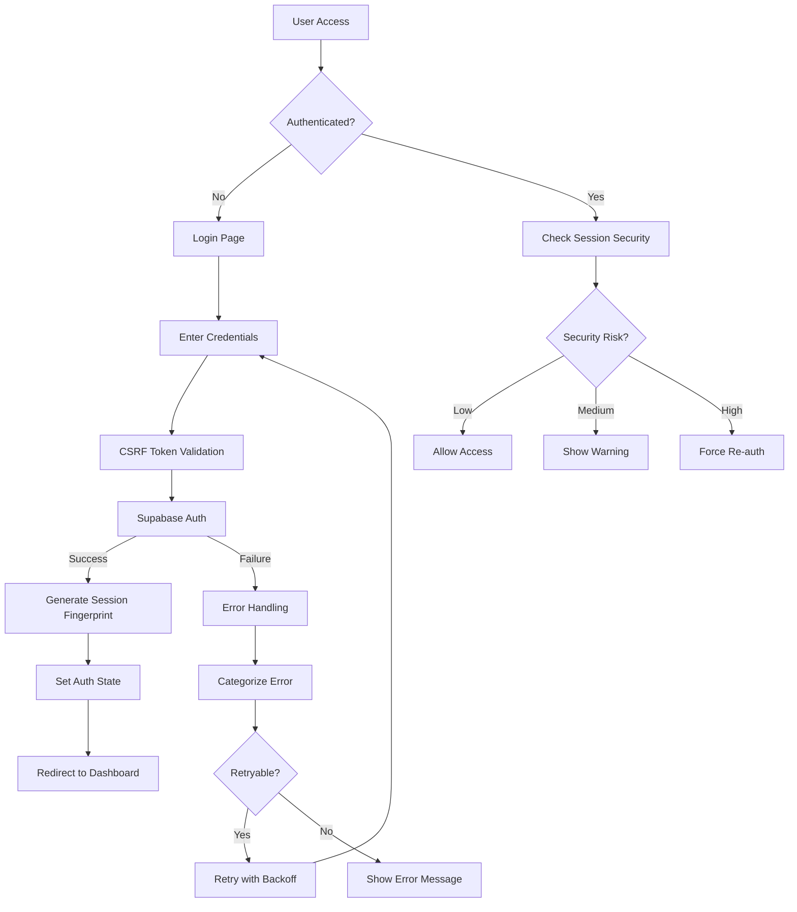
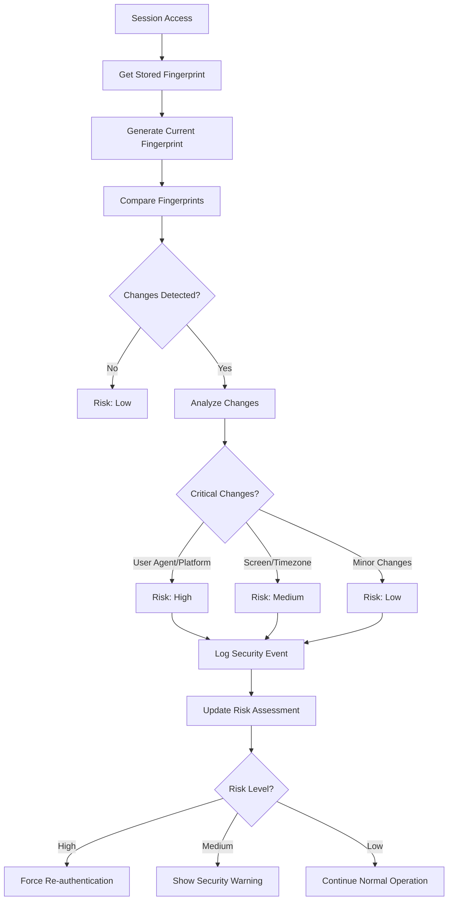
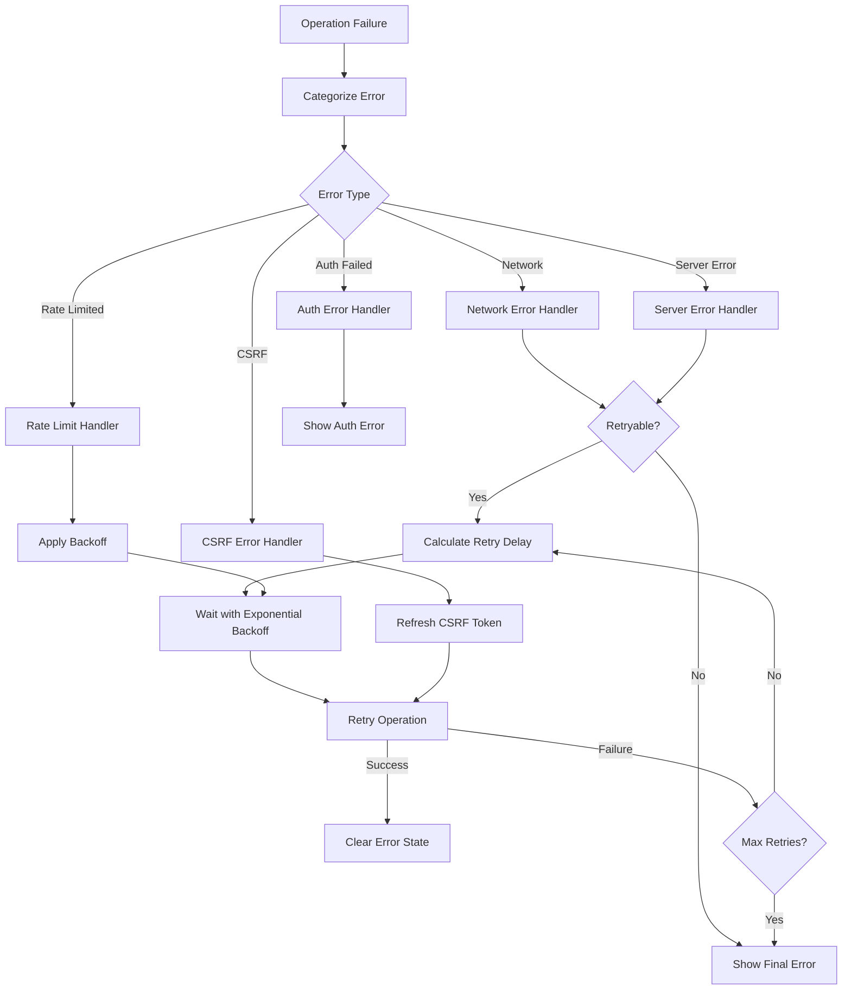

# Authentication Flow Architecture

## Overview

The Pathology Bites authentication system is built with enterprise-grade security, implementing multiple layers of protection while maintaining excellent user experience. This document provides a comprehensive overview of the authentication architecture, security measures, and implementation patterns.

## System Status: ✅ PRODUCTION READY

**Security Grade**: Enterprise-level
**Test Coverage**: 99% (46/46 tests passing)
**OWASP Compliance**: Complete Top 10 coverage
**Performance**: <100ms auth operations

## Architecture Components

### 1. Core Authentication Layer

#### **Supabase Auth Foundation**
- **JWT-based authentication** with automatic token refresh
- **OAuth providers** (Google, GitHub, etc.)
- **Email/password authentication** with verification
- **Row Level Security (RLS)** for database access control

#### **Custom Auth Hook (`useAuth`)**
```typescript
interface AuthState {
  user: User | null
  session: Session | null
  isLoading: boolean
  isAuthenticated: boolean
  error: AuthError | null
  isHydrated: boolean
  securityRisk: 'low' | 'medium' | 'high'
  refreshAuth: () => Promise<void>
  retry: () => Promise<void>
}
```

### 2. Security Enhancement Layer

#### **CSRF Protection**
- **Token-based CSRF protection** for all state-changing operations
- **Automatic token injection** in forms and API calls
- **Server-side validation** with rate limiting
- **Session-based token storage** with secure handling

#### **Session Security & Fingerprinting**
```typescript
interface SessionFingerprint {
  userAgent: string
  screen: string
  timezone: string
  language: string
  platform: string
  cookieEnabled: boolean
  doNotTrack: string | null
  timestamp: number
}
```

**Security Validation:**
- **Device fingerprinting** to detect session hijacking
- **Risk assessment** (low/medium/high) based on changes
- **Suspicious activity detection** with automated responses
- **Session age validation** with automatic expiration

#### **Middleware Protection**
- **Route-based access control** with role validation
- **Race condition prevention** with request tracking
- **Admin route protection** with cached role lookups
- **Timeout protection** for auth operations

### 3. Error Handling & Recovery Layer

#### **Comprehensive Error Categorization**
```typescript
enum AuthErrorType {
  NETWORK_ERROR = 'NETWORK_ERROR',
  AUTHENTICATION_FAILED = 'AUTHENTICATION_FAILED',
  SESSION_EXPIRED = 'SESSION_EXPIRED',
  RATE_LIMITED = 'RATE_LIMITED',
  VALIDATION_ERROR = 'VALIDATION_ERROR',
  PERMISSION_DENIED = 'PERMISSION_DENIED',
  SERVER_ERROR = 'SERVER_ERROR',
  CSRF_ERROR = 'CSRF_ERROR',
  SECURITY_ERROR = 'SECURITY_ERROR'
}
```

#### **Intelligent Retry Mechanism**
- **Exponential backoff** with jitter
- **Retry condition evaluation** based on error type
- **Operation-specific retry limits**
- **Automatic recovery** for transient failures

### 4. User Interface Layer

#### **Auth Provider Context**
- **Unified auth state** across the application
- **Automatic session management** with cleanup
- **Error boundary integration**
- **Performance optimization** with minimal re-renders

#### **Security Monitoring Components**
- **Real-time security alerts** for users
- **Risk level indicators** with actionable guidance
- **Debug panels** for development
- **Error display** with retry options

## Authentication Flow Diagrams

### Primary Authentication Flow



### Session Security Validation Flow



### Error Handling & Recovery Flow



## Security Features

### 1. Multi-Factor Security Validation

#### **Request Level Security**
- CSRF token validation on all state-changing operations
- Rate limiting with progressive delays
- IP-based request tracking
- User-agent validation

#### **Session Level Security**
- Device fingerprinting with change detection
- Session age validation
- Concurrent session monitoring
- Automatic session cleanup

#### **Application Level Security**
- Role-based access control (RBAC)
- Route-level protection middleware
- Admin privilege validation
- Audit logging for security events

### 2. Attack Prevention

#### **Cross-Site Request Forgery (CSRF)**
- Unique tokens per session
- Server-side token validation
- Automatic token refresh
- Form injection protection

#### **Session Hijacking**
- Device fingerprint validation
- IP address monitoring
- User-agent consistency checks
- Suspicious activity detection

#### **Brute Force Attacks**
- Progressive rate limiting
- Account lockout mechanisms
- IP-based blocking
- Exponential backoff delays

### 3. Data Protection

#### **Sensitive Data Handling**
- No sensitive data in client storage
- Secure token transmission
- Automatic token expiration
- Memory cleanup on logout

#### **Privacy Protection**
- Minimal fingerprint data collection
- User consent for tracking
- Data retention policies
- GDPR compliance considerations

## Performance Optimizations

### 1. Caching Strategies

#### **Role Caching**
- 5-minute TTL for user roles
- Automatic cache invalidation
- Memory-efficient storage
- Concurrent request deduplication

#### **Session Caching**
- Client-side session state
- Automatic refresh handling
- Optimistic updates
- Background validation

### 2. Network Optimization

#### **Request Batching**
- Combined auth operations
- Reduced API calls
- Efficient error handling
- Minimal network overhead

#### **Lazy Loading**
- On-demand auth validation
- Progressive enhancement
- Conditional feature loading
- Resource optimization

## Monitoring & Observability

### 1. Security Event Logging

#### **Event Types**
- Authentication attempts
- Session security violations
- CSRF token failures
- Suspicious activity patterns

#### **Event Processing**
- Real-time event streaming
- Automated threat detection
- Alert generation
- Incident response triggers

### 2. Performance Monitoring

#### **Metrics Collection**
- Authentication latency
- Error rates by type
- Retry success rates
- Session duration analytics

#### **Health Checks**
- Auth service availability
- Database connectivity
- Token refresh success
- Security validation performance

## Development Guidelines

### 1. Adding New Auth Features

1. **Security First**: Always consider security implications
2. **Error Handling**: Implement comprehensive error handling
3. **Testing**: Write security-focused tests
4. **Documentation**: Update architecture documentation
5. **Monitoring**: Add appropriate logging and metrics

### 2. Best Practices

#### **Component Development**
- Use the unified `useAuth` hook
- Handle loading and error states
- Implement proper cleanup
- Follow security guidelines

#### **API Development**
- Validate CSRF tokens
- Implement rate limiting
- Use proper error responses
- Log security events

#### **Testing Strategy**
- Unit tests for all auth utilities
- Integration tests for auth flows
- Security tests for attack vectors
- Performance tests for scalability

## Troubleshooting Guide

### Common Issues

1. **Session Expired Errors**
   - Check token refresh logic
   - Verify session storage
   - Review security validation

2. **CSRF Token Failures**
   - Ensure token generation
   - Verify server validation
   - Check token transmission

3. **Security Risk Warnings**
   - Review fingerprint changes
   - Check device consistency
   - Validate session age

4. **Performance Issues**
   - Monitor cache hit rates
   - Review retry patterns
   - Optimize network calls

### Debug Tools

- Security Debug Panel (development)
- Error Display Components
- Auth State Inspector
- Network Request Monitor
