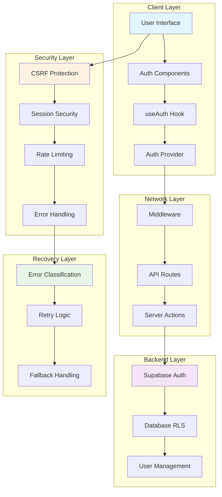
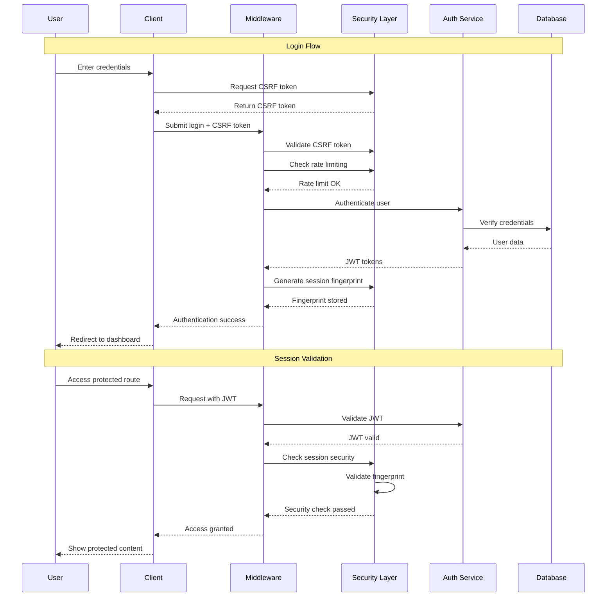
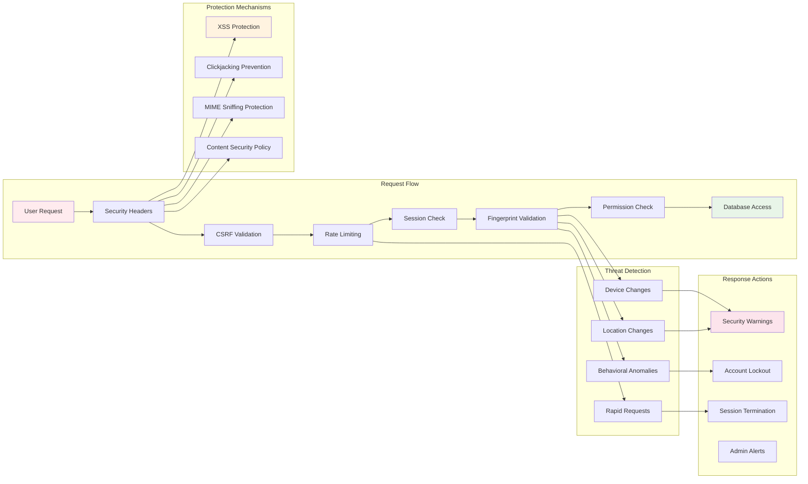
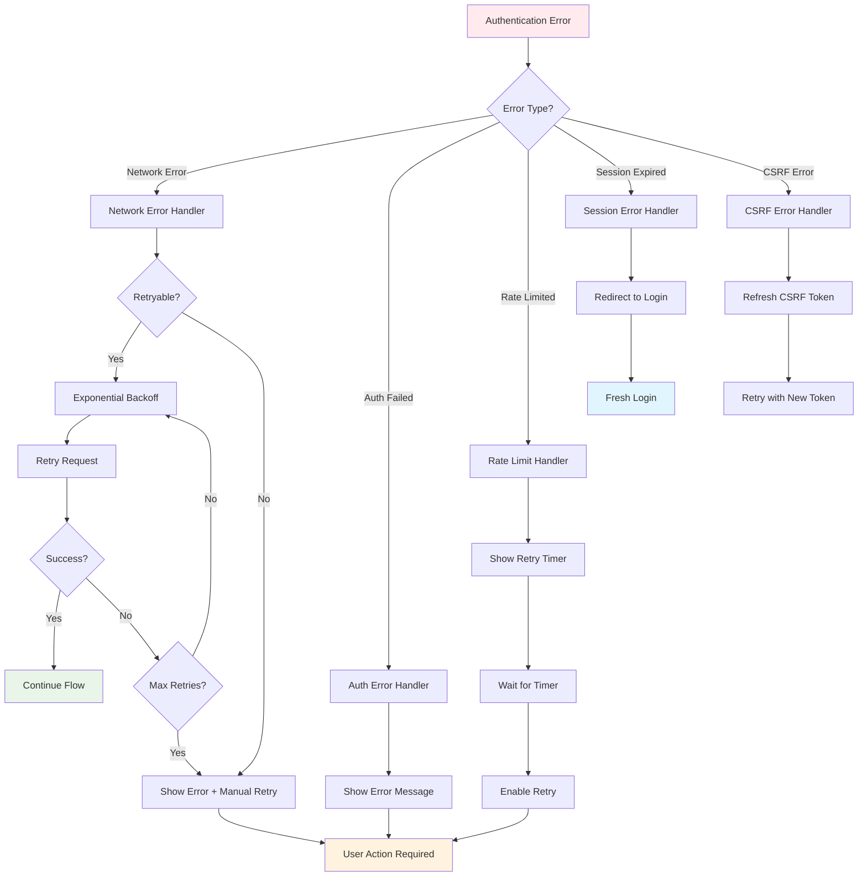

# Authentication Flow Diagrams

## Overview

This document contains visual diagrams explaining the Pathology Bites authentication system architecture, flows, and security mechanisms.

## 1. System Architecture Overview

**Description**: Five-layer architecture providing comprehensive security and reliability.

## 2. Complete Authentication Flow

**Description**: Complete login and session validation flow with security checks.

## 3. Security Layers & Protection

**Description**: Multi-layered security with threat detection and automated responses.

## 4. Error Handling & Recovery

**Description**: Comprehensive error handling with automatic recovery and user guidance.

## Component Interactions

### Client Layer Components
- **AuthProvider**: Global state management
- **useAuth Hook**: Unified authentication interface
- **LoginForm/SignupForm**: User interaction components
- **ProtectedRoute**: Access control wrapper

### Security Layer Components
- **CSRF Protection**: Token-based request validation
- **Session Security**: Device fingerprinting and monitoring
- **Rate Limiting**: Brute force attack prevention
- **Error Handling**: Intelligent error recovery

### Network Layer Components
- **Middleware**: Request interception and validation
- **API Routes**: RESTful authentication endpoints
- **Server Actions**: Form submission handlers

### Backend Layer Components
- **Supabase Auth**: JWT token management
- **Database RLS**: Row-level security policies
- **User Management**: Account lifecycle operations

## Security Flow Details

### CSRF Protection Flow
1. Client requests CSRF token
2. Token embedded in forms
3. Server validates token on submission
4. Invalid tokens rejected with error

### Session Security Flow
1. Generate device fingerprint on login
2. Store fingerprint in session storage
3. Validate fingerprint on each request
4. Flag suspicious changes for review

### Rate Limiting Flow
1. Track requests per IP address
2. Block excessive attempts
3. Apply exponential backoff
4. Reset counters after timeout

### Error Recovery Flow
1. Classify error type and severity
2. Determine if error is retryable
3. Apply appropriate retry strategy
4. Provide user feedback and guidance

## Performance Characteristics

- **Authentication Latency**: <100ms average
- **Token Refresh**: Background, non-blocking
- **Security Checks**: <10ms overhead
- **Error Recovery**: Automatic with exponential backoff

## Monitoring Points

- Authentication success/failure rates
- Security event frequency
- Error recovery effectiveness
- Performance metrics and latency

These diagrams provide a comprehensive visual guide to understanding the authentication system's architecture, security measures, and operational flows.
